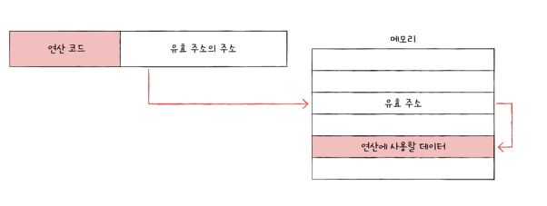
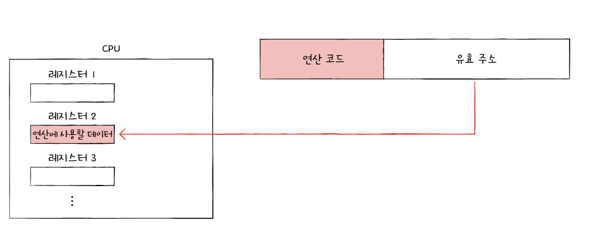
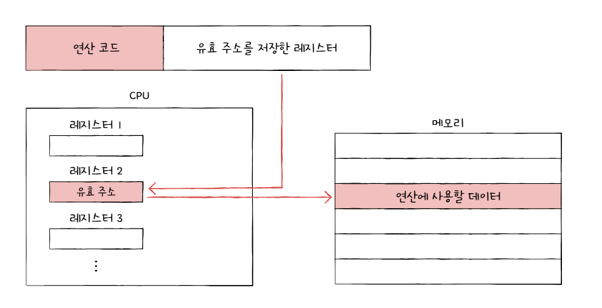

# Chapter 03 - 1

고급언어로 작성된 소스코드가 실행되려면 반드시 저급언어 즉 명령어로 변환되어야함
고급언어 -> 저급언어

고급언어를 저급언어로 변환하는 과정
- 컴파일 언어: 코드 전체가 저급언어로 변환되는 과정
- 인터프리터 언어: 인터프리터에 의해 소스코드가 한줄씩 실행되는 고급언어

### Question
근데 그러면 두가지 방법을 나눠놓은 이유가 뭐까? 그냥 둘중하나만 쓰면 되는거 아닌가? 라는 의문

컴파일 방식: 완성해서 배포하는 프로그램 – 실행속도가 중요할 때 ex) 게임, 운영체제, 스마트폰 앱
- 개발자가 코드를 한번에 다 짜고 딱 한번 컴파일해서 실행파일을 만듦
- 이미 번역된 기계어만 받아서 실행하니까 빠르게 실행돰
- 개발중에 코드 한줄 고칠때마다 매번 컴파일 해야함 -> 개발자 입장에서는 번거러움

인터프리터 방식: 자주 수정하고 바로 테스트 해봐야하는 상황 ex)데이터 분석, 스크립트 작업, 프로토타입 개발, 주로 python에서 사용
- 코드를 한줄한줄 고치고 바로 실행해서 실시간으로 결과 확인 가능 -> 개발 속도 빠름, 디버깅 편함
- 실행할때마다 매번 한줄씩 통역하기 때문에 최종 실행속도는 느림

# Chapter 03 - 2

## 오퍼랜드 필드와 주소 지정 방식

### 명령어 구조
- 명령어 = 연산 코드 필드 + 오퍼랜드 필드(들)로 구성
- 명령어 전체 길이는 고정되어 있음 (예: 16비트)

### 오퍼랜드 필드에 들어가는 것
- 오퍼랜드 필드에는 주로 메모리 주소나 레지스터 이름이 담김
- n비트 필드는 2^n개의 값만 표현 가능 → 표현 가능한 주소 개수 = 2^n개

예시:
- 오퍼랜드 필드 6비트 → 2^6 = 64개 주소까지만 표현 가능 (0~63번지)
- 오퍼랜드 필드 16비트 → 2^16 = 65,536개 주소까지 표현 가능

### Question
오퍼랜드 필드 개수가 늘어나면 좋은 거 아닌가?
오퍼랜드 필드 개수가 늘어나면 한 명령어로 더 많은 주소들을 가리킬 수 있다. 그러면 그냥 계속 개수를 늘려서 사용하면 되는 거 아닐까? 라는 의문이 든다.

결론부터 말하면, 무조건 늘리는 게 좋은 것은 아니다.
- 명령어 전체 길이는 고정되어 있음
- 오퍼랜드 개수를 늘리면 → 고정된 길이를 더 잘게 쪼개서 사용해야 함
- 그 결과 필드 하나하나는 좁아짐
- 필드가 좁아지면 → 그 필드가 표현 가능한 주소의 범위가 줄어듦

즉 오퍼랜드 필드 개수가 많을 때
- 한번에 가리킬 수 있는 위치의 수 -> 늘어남
- 그 각각의 필드 하나가 가리킬 수 있는 주소의 범위 -> 줄어듦(작음)

**결론**: 오퍼랜드 개수를 늘리는 것도 무조건 좋은 것은 아니다. 상황에 맞게 트레이드오프 관계를 고려해서 설계해야 한다.

> 트레이드오프: 하나를 얻으려면 다른 하나를 포기해야 하는 관계. 동시에 둘 다 최대로 가질 수는 없고, 하나를 늘리면 다른 하나가 줄어드는 관계

### 주소 지정 방식

**즉시 주소 지정 방식**
- 오퍼랜드 필드에 데이터 자체를 넣음

**직접 주소 지정 방식**
- 오퍼랜드 필드에 메모리 주소(유효주소)를 적음

> 유효주소: 연산의 대상이 되는 데이터가 저장된 위치

**간접 주소 지정 방식**
- 오퍼랜드 필드에 유효주소가 적힌 곳의 주소를 적음

**레지스터 주소 지정 방식**
- 직접 주소 지정 방식과 똑같은데 메모리 주소를 적는 것이 아니라 레지스터 번호를 적음

**레지스터 간접 주소 지정 방식**
- 간접 주소 지정 방식과 똑같은데 유효 주소가 적힌 곳이 메모리가 아니라 레지스터 번호를 적음

