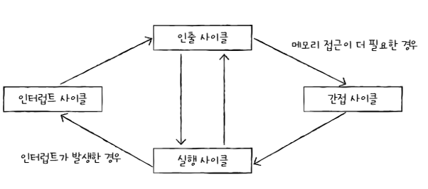

# Chapter 04 - 1

ALU는 연산결과 + 플래그를 내보냄

### 플래그
- 연산 결과에 대한 추가적인 상태정보

### 제어장치가 받아들이는 과정
1. 제어장치는 클럭 신호를 받아들인다
   > 클럭: 컴퓨터의 모든 부품을 일사불란하게 움직일 수 있게 하는 시간 단위
2. 제어장치는 해석해야 할 명령어를 받아들인다.
3. 제어장치는 플래그 레지스터 속 플래그 값을 받아들인다.
4. 제어장치는 제어버스로 전달된 제어 신호를 받아들인다.

### 제어장치가 내보내는 정보
- CPU 외부에 전달하는 제어신호
    - 메모리에 전달하는 제어신호
    - 입출력장치에 전달하는 제어신호
- CPU 내부에 전달하는 제어신호
    - ALU에 전달하는 제어신호
    - 레지스터에 전달하는 제어신호

# Chapter 04 - 2

### 레지스터 종류
- 프로그램 카운터
- 명령어 레지스터
- 메모리 주소 레지스터
- 메모리 버퍼 레지스터
- 범용 레지스터
- 플래그 레지스터

# Chapter 04 - 3

### 명령어 사이클
- 인출 사이클
- 실행 사이클
- 간접 사이클
- 인터럽트 사이클

### 인터럽트
- 동기 인터럽트(예외)
    - 폴트
    - 트랩
    - 중단
    - 소프트웨어 인터럽트
- 비동기 인터럽트(하드웨어 인터럽트)
    - 막을 수 있는 인터럽트
    - 막을 수 없는 인터럽트

### Question
그러며 인터럽트가 발생하면 CPU가 하던일을 중단시키는건데 전에 했던 작업들은 어디로 갈까?
- 인터럽트가 발생하면 CPU가 자동으로 스택에 저장을 해놈
- 즉 순서는 인터럽트 발생 -> 현재 상태를 스택에 저장 -> 인터럽트 서비스 루틴 -> 처리가 끝나면 스택에 저장했던걸 가지고옴(복원) -> 원래 하던 작업 계속 진행

### 인터럽트 처리 순서

