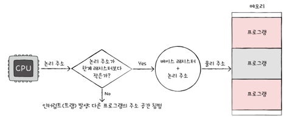

# Chapter 06 – 1

RAM
- DRAM
- SRAM
- SDRAM
- DDR SDRAM

## Question

>Q. SDRAM은 클럭 신호와 동기화된 발전된 형태의 RAM이라고 한다. 즉 클럭 신호에 맞춰 CPU와 정보를 주고 받을 수 있음을 의미한다. 그러나 우리는 전에 정보 교환을 할때는 클럭신호에 맞춰서 교환을 진행한다고 배웠는데 RAM도 똑같은게 아닌가? SDRAM은 당연한걸 특별하게 취급을 하는걸까?

모든 RAM이 클럭을 사용하는건 아니다. SDRAM이전에는 클럭 없이 동작하는 비동기 RAM이라는 것이 먼저 존재했다. -> 매번 RAM에게 CPU가 "다했어?", "아직이야?"라고 계속 물어보면서 확인을 하면서 정보를 주고 받는다는 뜻이다.
CPU는 빠른 클럭으로 움직이는데 RAM이 그 타이밍이 맞지 않음
-> CPU가 신호를 기다리며 애매한 시간을 낭비
-> 매번 확인 신호를 주고받는 데 불필요한 시간이 들음

이러한 단점을 보완해서 나온 것이 SDRAM -> 아예 CPU의 클럭속도에 맞춰서 움직이자
- CPU가 언제 데이터가 올지 미리 알고 있으니까, 애매하게 기다리는 시간 없이 딱 맞춰 다음 동작을 준비할 수 있음
- 효율적인 정보교환

---

# Chapter 06 – 2

CPU는 메모리에 접근하기 전에 접근하고자 하는 논리주소가 현재 한계레지스터 보다 작은지 확인

- Yes -> 베이스 레지스터 + 논리주소 물리주소를 찾아냄
- No -> 인터럽트(트랩)을 발생시켜서 실행을 중단 시킴

---

# Chapter 06 – 3

저장장치 계층구조
1. 레지스터
2. L1
3. L2
4. L3
5. 주기억장치
6. 보조기억장치

**참조의 지역성**
- 시간 지역성
- 공간 지역성
