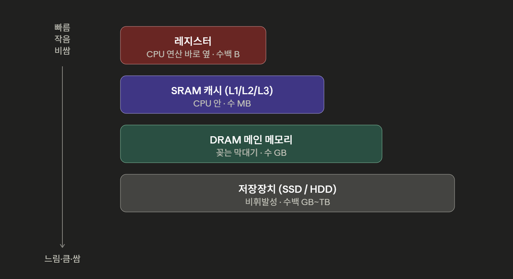
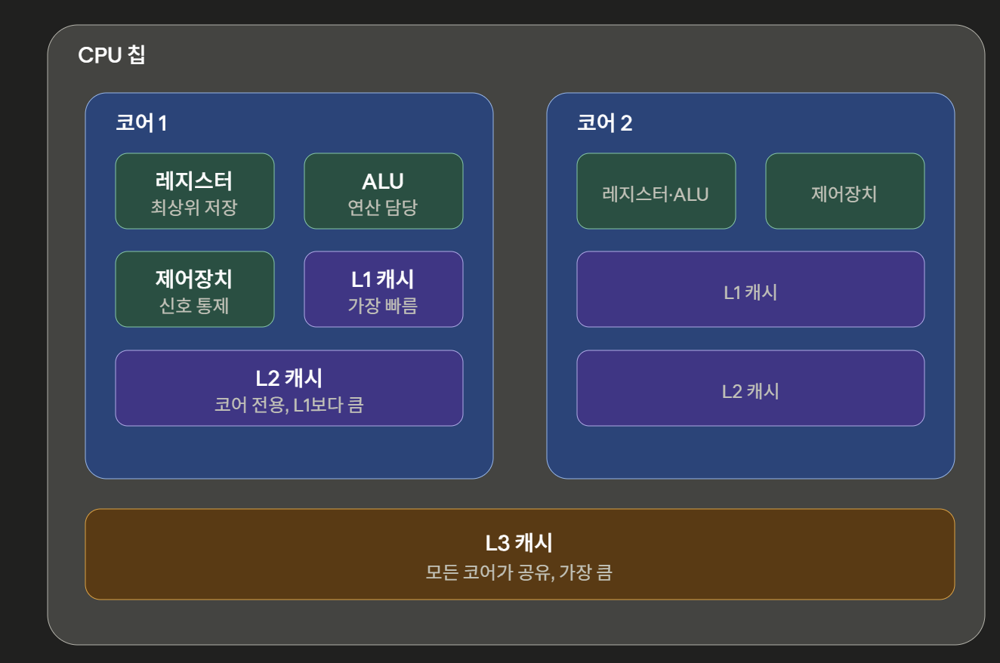

## Chapter 6-1 RAM의 특징과 종류

주요 키워드: RAM, DRAM, SRAM, SDRAM, DDR SDRAM

### 궁금해요

RAM의 종류 SRAM과 DRAM의 설명에서 나는 RAM을 꽂을 때 SRAM과 DRAM을 나눠 꽂은 적이 없는데, **RAM 8기가. 16기가 이런 건 어떤 걸 말하는 걸까?**

내가 물리적으로 꽂은 막대기(RAM)은 DRAM이다. RAM 8GB, 16GB할 때 RAM은 DRAM이며 SRAM은 CPU 안에 이미 들어 가 있다.(레지스터랑 다른가? → 사촌쯤 된다)

SDRAM은 클럭 신호와 동기화되어, 클럭에 맞춰 동작하며 클럭마다 CPU와 정보를 주고받는 DRAM이다.

**그렇다면, 이게 어떤 장점과 단점을 가지고 있는 RAM의 종류인걸까?**

Synchronous(동기식)은 공통 시계(클럭)을 도입함으로써 CPU에게 몇 박자 후에 데이터가 나온다는 걸 미리 알 수 있다. 따라서 CPU가 기다리는 시간을 없앨 수 있다는 장점이 있다.(like 파이프라이닝) 하지만, 동기식이라 클럭에 묶이게 된다. 클럭 속도가 곧 성능 한계다. 따라서, 클럭 속도를 계속 올려야 성능이 따라온다.

## Chapter 6-2 메모리의 주소 공간

주요 키워드: 물리 주소, 논리 주소

## Chapter 6-3 캐시 메모리

주요 키워드: 캐시 메모리, 저장 장치 계층 구조, 시간 지역성, 공간 지역성

### 궁금해요

캐시가 코어 안에 있다.

**그렇다면, 코어 안의 구조는 어떻게 생겼을까? 그리고 Level은 왜 0이 아닌 1부터 시작일까?**

L0 자리는 이미 차 있다. 운영체제 분야의 대표 교과서인 실버샤츠(Silberschatz)의 『Operating System Concepts』를 비롯한 표준 교재와 여러 자료에서는 레지스터를 L0으로 표현하기도 한다.
