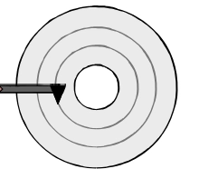

## Chapter 7-1 다양한 보조기억장치

주요 키워드: 하드 디스크, 플래터, 데이터 접근 시간, 플래시 메모리, 페이지, 블록

## Chapter 7-2 RAID의 정의와 종류

주요 키워드: RAID, RAID Levels

## 궁금해요

L1 캐시 참조 시간은 0.5ns였다. 나노초가 뭘까.

**1초보다 작은 단위를 알아보자**

⇒

| **단위**                     | **기호**   | **초(s) 환산**          | **사용 예시 / 특징**                               |
| ---------------------------- | ---------- | ----------------------- | -------------------------------------------------- |
| **밀리초** (Millisecond)     | **ms**     | 10^-3 초 (1/1,000초)    | 디스플레이 응답속도, 카메라 셔터 속도              |
| **마이크로초** (Microsecond) | $\mu$**s** | 10^-6 초 (1/100만 초)   | 컴퓨터 프로세서(CPU) 내부 연산 속도                |
| **나노초** (Nanosecond)      | **ns**     | 10^-9 초 (1/10억 초)    | 반도체·메모리 액세스 속도, 광선 이동 거리(약 30cm) |
| **피코초** (Picosecond)      | **ps**     | 10^-12 초 (1/1조 초)    | 레이저 분광학, 분자 진동 관측                      |
| **펨토초** (Femtosecond)     | **fs**     | 10^-15 초 (1/1000조 초) | 화학 반응에서 원자 결합이 끊어지는 순간 측정       |
| **아토초** (Attosecond)      | **as**     | 10^-18 초 (1/100경 초)  | 원자 내부 전자의 움직임을 관찰하는 시간 영역       |
| **제프토초** (Zeptosecond)   | **zs**     | 10^-21 초               | 원자핵 내부 현상 측정 단위                         |
| **요크토초** (Yoctosecond)   | **ys**     | 10^-24 초               | 기본 입자 간 상호작용 시간                         |

1000분의 1씩 곱해져 작아지는구나~

---

탐색 시간과 회전 지연을 단축하기 위해서 플래터의 RPM상승도 좋지만, 참조 지역성이 중요하다고 한다.



**회전 방향도 고려하는 것인지? 다른 트랙에 둔다면 트랙을 옮기는 게 빠른지 같은 트랙 내에서 근처에 두는 것이 좋은건지? 좀 더 자세히.**

⇒ 회전 방향도 고려한다. 플래터는 한 방향으로(보통 반 시계) 계속 회전한다. 헤드가 읽고자하는 섹터의 바로 앞을 통과했다면 한 바퀴 더 돌아야한다. 같은 트랙 내 근처라도 바로 앞이라면 ok. 한 바퀴 더 돌아야 한다면 no. (방향을 고려해서 지역 참조성을 적용)

---

플래시 메모리에서 읽기와 쓰기는 페이지 단위지만 삭제는 블록 단위이다.

**왜 삭제는 블록 단위일까? 이 물리적 불일치 때문에 GC(가비지 컬렉터)가 괜히 필요하지 않나?**

⇒ 일단 cell의 구조를 살펴보자.

```java
[ 지붕 (Control Gate) ]  <-- 페이지(Page) 단위로 쪼개져 있음! (개별 제어 가능)
-------------------------
[ 서랍 (Floating Gate) ] <-- 전자가 갇히는 곳 (0 / 1 저장)
========================= (절연체)
[ 바닥 (Substrate) ]     <-- 블록(Block) 전체가 하나의 바닥을 공유함! (통째로 제어)
```

cell이란 전자를 가두는 장치인데 전자를 서랍에 넣느냐(쓰기) 빼느냐(삭제)에 따라 전기를 가하는 방향이 다르다. 쓰기는 지붕에 (+) 전압을 걸어 바닥에 있던 전자를 서랍 안으로 끌어 당기는 것인데 지붕은 페이지 단위로 스위치가 쪼개져 있으므로 원하는 특정 페이지만 전기를 가할 수 있다(쓰기 할 수 있다).

하지만, 삭제를 위해선 바닥에 강한 (+) 고전압(약 20V)을 걸어야한다. 근데 바닥은 또 블록 전체가 하나로 연결된 거대한 판이기에, 하나의 페이지 혹은 셀을 지우려 해도 모두 빠져나오게 된다.

**그렇다면, 왜 천장은 페이지 단위로 쪼개져있고 바닥은 블록 단위 통짜인가?**

⇒ 지붕을 페이지 단위로 쪼갠 이유는 최소한 데이터는 원하는 크기대로 골라서 쓸 수 있어야 하기 때문이다. 컴퓨터에서 파일을 저장할 때 4KB, 8KB 같은 아주 작은 단위로 수시로 저장하기 때문이다. 그리고 회로 부담이 적다. (저전압이니까. 약 10V 이하) 바닥이 블록 단위인 이유는 삭제의 전압이 20V로 강하고 이를 견디기 위해선 회로의 크기가 커지게 된다.(고전압을 견디기 위한 절연 벽도 깔아야됨.)

---

RAID4 방식에서 패리티 비트가 등장한다.

**패리티 비트란 무엇이길래 오류 검출이 가능한걸까?**

⇒ 패리티 비트에 저장되는 것은 데이터 전체의 복사본이 아니라, "데이터 안에 숫자 1이 총 몇 개 들어있는지(짝수개인지, 홀수개인지)를 나타내는 1비트 신호"이다. 이를 통해 받는 데이터와 보낸 데이터의 1의 갯수를 (보통 짝수 패리티 방식) 비교하는 것이다. 이렇다 보니, 한계점이 존재한다.

**패리티 계산법이란 무엇일까? (책에서 넘어감)**

⇒ 패리티 계산법의 핵심은 XOR 비트 연산이다. Exclusive OR, 배타적 논리합이라고도 하는데, 두 값이 같으면 0, 다르면 1을 내놓는 연산이다.

0 XOR 0 = 0 / 1 XOR 1 = 0 (같으면)

1 XOR 0 = 1 / 0 XOR 1 = 1 (다르면)

이를 이용해 복구하는 것이다. 만약 Disk2에 문제가 생겼다면 패리티 비트를 통해 Disk2의 정보룰 100% 복구가 가능하다.
