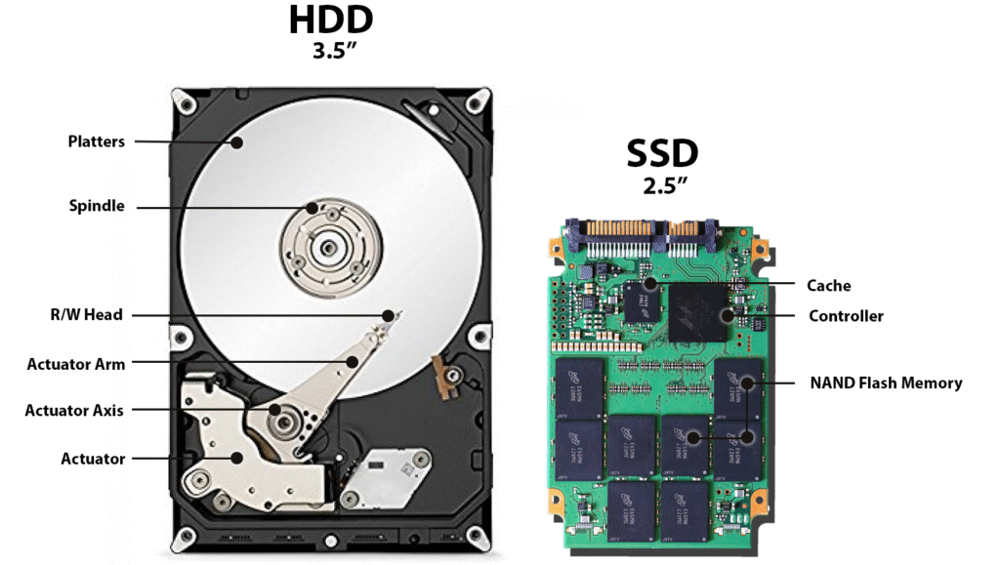
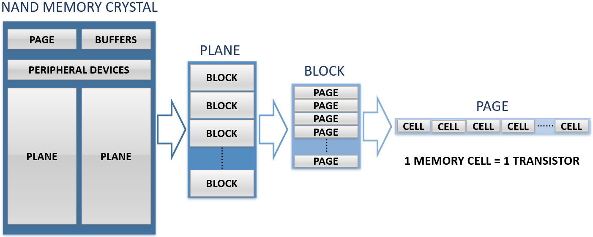
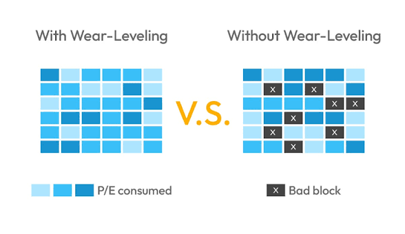
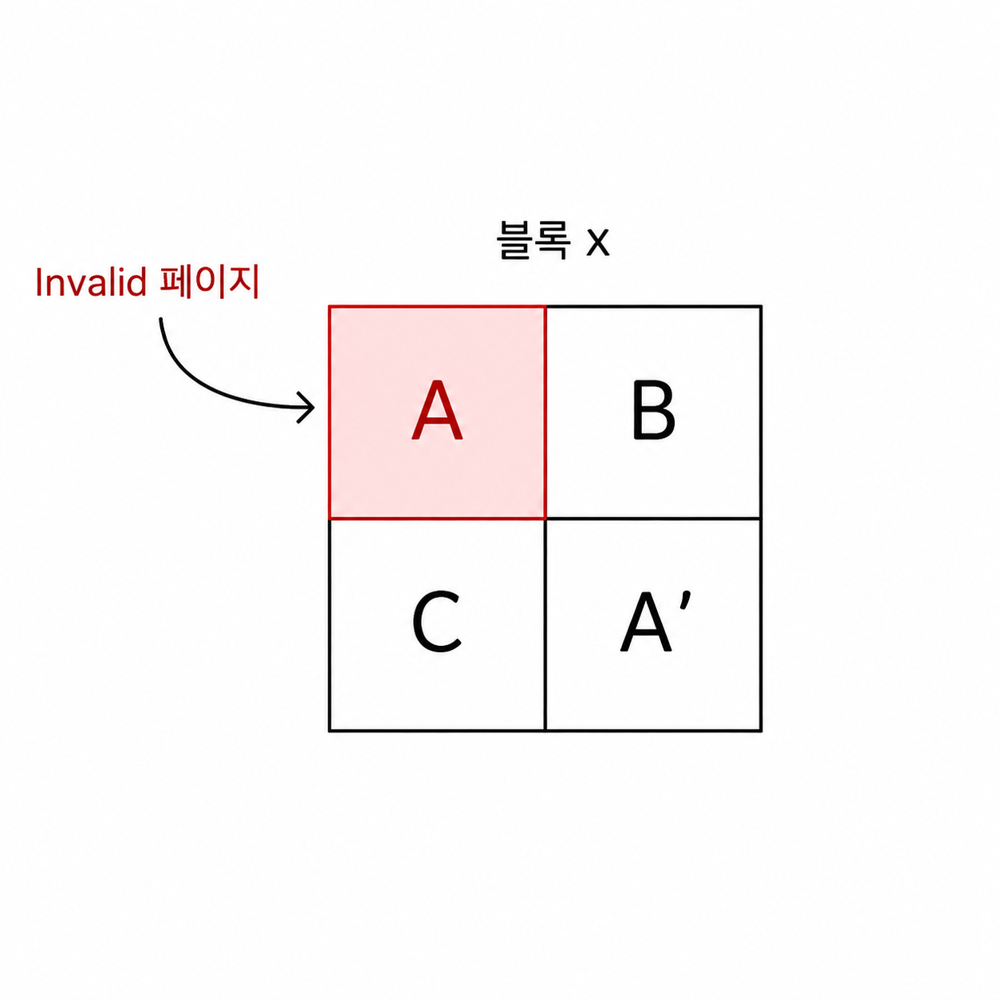

# 7장 - 보조기억장치

HDD (Hard Disk Drive) - 회전하는 Platter에 Arm이 움직이며, 데이터를 물리적으로 읽고 쓰는 저장장치

SSD (Solid State Drive) - 움직이는 부품없이 플래시 메모리 방식(전기로)으로 데이터를 I/O.  


>Q. 플래시 메모리의 데이터를 저장하는 가장 작은 단위는 cell이다. 이것이 모여 MB, GB, TB를 이룬다는데, cell은 그럼 단위가 용량의 단위가 어떻게 되는지?

>A. cell은 bit를 저장하는 "물리적"인 공간이고,
bit는 cell 안에 저장되는 논리적인 데이터(0, 1)를 뜻함.

---
### cell -> page -> block -> plane -> die 순임


### 플래시 메모리에서 I/O는 페이지 단위로 이루어진다!

>Q. 플래시 메모리는 I/O할때마다 cell/page의 절연막이 조금씩 열화됨. 그러면 무언가 관리를 해줘야하지 않을까?

>A. cell/page을 골고루 사용하자는 wear leveling(우선순위큐 Greedy)이라는 알고리즘을 적용함. cell뿐만 아니라 수명이 중요한 disk 류에는 이러한 관리 알고리즘이 세게 걸려있다.


----

Page는 Free, Valid, Invalid 상태가 존재하고, A를 A'으로 바꾸고 싶을때는 기존값을 Invalid 상태로 바꾼다음 빈 곳에 A'를 적는다.

그래서 이런 Invalid한 page들을 처리하기 위해서 SSD를 비롯한 플래시 메모리에서도 GC기능을 제공함.


> Q. 플래시 메모리는 왜 기존 데이터에 바로 덮어쓰지 못하게끔 설계 되었을까? 덮어쓰는게 메모리상 이득 아닌가? 왜 귀찮게 Invalid시키고 GC함?

> A. 인정. 쓰기 효율만 보면 덮어쓰기가 유리하다. 하지만 Cell마다 개별 삭제 회로를 두면 Cell이 커지고 비싸져 저장 밀도가 크게 떨어진다. 플래시 메모리 방식은 이를 포기하고 여러 Cell을 묶어 Block 단위로 삭제하는 대신, 훨씬 많은 Cell을 싸게 집적하는 방식을 택했다.

덮어쓰기 효율을 희생하고 고용량 및 저가격을 얻은 Trade Off이며, 그 불편함을 Invalid/GC로 해결한다고 정리할 수 있겠다.

---
### RAID, 즉 다양한 disk 및 parity bit을 활용한 오류처리의 관리는 누가할까?
- Hardware RAID
  - 별도의 하드웨어가 윗단에 있음.
  - 데이터 분산, 패리티 계산, 장애 감지, Rebuild 등을 컨트롤러가 수행
  - OS에는 여러 디스크를 하나의 논리 디스크처럼 보여줌

- Software RAID
  - 별도 장비 없이 OS가 여러 디스크를 관리
    - Nested RAID(하나의 논리 디스크를 여러개 관리)
      ```text
          [물리 Disk들]
                ↓
          Hardware RAID
             ↓
        논리 Disk A   논리 Disk B
            ↘       ↙
            Software RAID
                ↓
            논리 Disk C
        ```
  - 시스템의 CPU/RAM을 사용해 RAID 연산 수행
  - 모니터링, 장애 알림, 자동 Rebuild 등 소프트웨어 자동화와 연계하기 쉬움
  - Linux에서는 대표적으로 MD + mdadm.