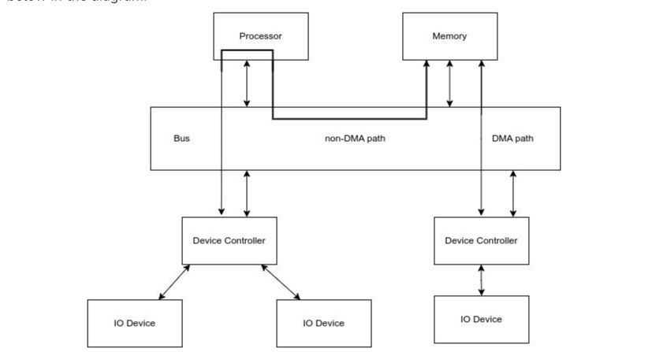
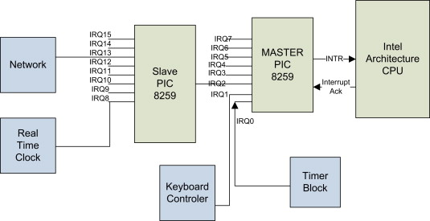
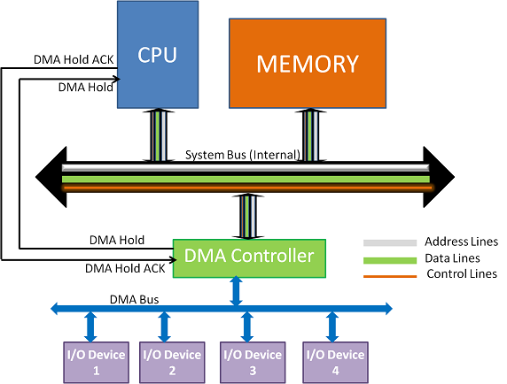

# 8장 - 입출력장치

많은 입출력 장치들은 각자 다른 방식을 갖고 있다. CPU가 각기 다른 I/O장치들을 이해하기는 힘듦. 그래서 device controller가 중계역할을 한다.

### 장치 컨트롤러(Device Controller, I/O Controller)
하드웨어(I/O, HDD) 앞단에서 데이터 버퍼링, 오류 검출 등의 역할을 하며 SYSTEM BUS를 통해 CPU와 데이터를 주고 받는다.

I/O장치가 CPU에게 인터럽트 요청을 보내 인터럽트 서비스 루틴을 진행한다고 배웠었는데, 사실은 device controller가 진행하고 있던 것!

---
### 장치 드라이버(device driver)
엔비디아, 로지텍 등 각자 Device Controller들이 다를 것임. 각자 다른 device controller를 감지하고 제어하게끔 하는 프로그램이다.

device driver를 인식하고 실행하는 주체는 OS이고, 이를 제공하는 것은 그 device controller방식을 만든 회사임. 없으면 다운받아야 함.

--- 

> Q. 인터럽트 방식으로 CPU에게 입출력을 알려주는 것으로 알고 있는데, 폴링 방식은 CPU가 I/O 장치에게 주기적으로 물어본다. 바쁜 CPU에겐 손해인 작업 아닌가?

> A. 이벤트가 드문 상황에서는 CPU가 계속 확인해야 하는 폴링이 손해가 맞음. 그리고 그렇게 설계되어야 CPU가 다른 할일에 집중할 수 있겠지. 하지만 인터럽트 역시 CPU가 하던 작업을 멈추고 상태 저장 → ISR 실행 → 복귀하는 비용이 발생. 따라서 주기적으로 들어오는 고성능 네트워크 패킷 같은 경우는 이를 Polling 방식으로 한번에 확인함.

---
### PIC(Programmable Interrupt Controller)
여러 device controller에서 보낸 하드웨어 인터럽트 요청들의 우선순위를 판별한 뒤 CPU에게 알려줌.

> Q. NMI(Non-Maskable Interrupt)는 가장 먼저 처리해야하는 인터럽트이다. 어떤 종류가 있고, PIC 제일 상단에 꽃히는걸까?

> A. NMI는 심각한 하드웨어 오류나 복구할 수 없는 OS오류들이 있음. 블루스크린 띄워버림. 이는 PIC를 거치지 않고 바로 실행된다.

---
### DMA(Direct Memory Access)
I/O 장치와 메모리 사이에 전송되는 모든 데이터가 CPU를 거치면 가뜩이나 바쁜 CPU는 더 바빠짐.
CPU를 거치치 않고 바로 Memory에 접근하는 방식을 DMA라고 함.

아래 사진처럼 DMA Controller가 존재하고 System Bus도 따로 씀.(Cpu가 쓰는 Bus를 방해하지 않기 위해)

> Q. DMA가 직접 데이터는 개념이면, 어디로 전송할지 RAM 주소 같은 정보도 DMA Controller가 스스로 결정하는가?

> A. DMA Controller가 RAM 어디에 알잘딱으로 넣어주는 것은 아님. DMA Controller는 실제 데이터 전송을 담당하는 하드웨어이고, 어디로 얼마나 전송할지는 장치 드라이버가 설정한다(OS가 설정한다고 봐도 무방).