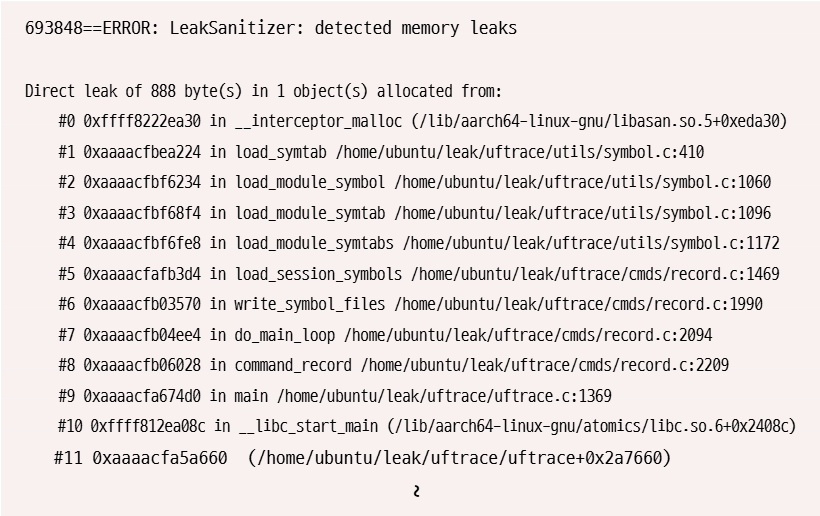
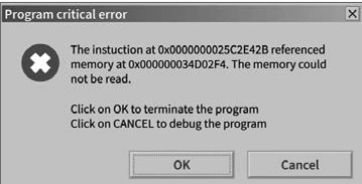

## Chapter 9-1 운영체제를 알아야 하는 이유

주요 키워드: 운영체제, 문제 해결

### 궁금해요

책에서 운영체제와의 대화 예시의 대표로 메모리 누수 현상과 잘못된 주소 참조에 대해서 소개해줬다. 하지만 해당 현상이 어떤 것인지에 대해서는 다루지 않았다.

> Q. 메모리 누수 현상



693848: 운영체제가 부여한 프로세스 번호(PID)를 의미한다.

==: 의미는 딱히 없다. 로그 포맷 규칙으로 사용된다.

ERROR: 로그가 정보성 메시지가 아닌 오류(에러)수준 임을 명시한다.

LeakSanitizer: 어떤 도구가 이 메시지를 냈는지? → 메모리 누수를 감지해주는 디버깅 도구이다.

detected memory leaks: 메모리 누수를 감지했다는 실제 메시지이다.

전체 문장: "PID가 693848번인 이 프로세스를 감시하고 있던 LeakSanitizer라는 디버깅 도구가, 이 프로그램에서 메모리 누수를 발견했다”

> Q. 메모리 누수 현상은 왜 발생하는가?

Direct leak of 888bytes. 888바이트짜리 메모리 1개를 할당해놓고 해제하지 않았다고 말하고 있다. C/C++과 같은 언어에서 malloc과 같은 메모리 할당 이후 free()로 메모리를 해제 하여야한다. 이걸 깜빡한 모양이다. 한두 번이면 큰 문제가 없지만, 지속된다면 불필요한 메모리 낭비로 이어진다.

> Q. 잘못된 메모리 참조 현상



"0x...E42B 주소에 있는 명령어가 0x...02F4라는 메모리 주소에 접근하려고 했는데, 그 주소를 읽을 수 없었다.” 라고 한다. 이 현상은 4가지 정도의 케이스가 존재한다.

1. 널 포인터 참조
2. 이미 해제된 메모리 접근
3. 배열 범위를 벗어난 접근
4. 잘못된 포인터 연산

> Q. 운영체제가 어떻게 알아낸걸까?

앞서 배웠던 커널의 메모리 관리 기능 덕분이다. OS가 각 프로그램들에게 너는 이 메모리 영역을 사용해라~. 오케스트레이터의 역할을 하고 있기 때문에 할당되지 않은 영역이나 이미 반납한 영역을 건드릴 때 CPU가 이를 감지하는 것이다.

> Q. 운영체제가 어떻게 알아낸걸까? V2

메모리가 CPU에게 인터럽트를 보내서 알아내는 걸까? CPU는 어떻게 잘못된 메모리 참조를 알아차릴까?

CPU 안에는 MMU가 존재한다. 메모리 관리 장치를 의미하는데 이 MMU가 알아차린 것이다. OS는 각 프로그램에게 “가상 주소”를 나눠주는데

```java
프로그램: "0x000000034D02F4 주소를 읽고 싶어!" (가상 주소)
↓
MMU가 페이지 테이블을 확인
↓
"어? 이 주소는 이 프로세스한테 할당된 적이 없는데?"
또는 "이미 반납된(free된) 영역인데?"
↓
MMU가 이 요청을 거부하고 CPU에게 예외(exception) 신호를 보냄
```

위의 과정을 통해 프로그램이 메모리에 접근 하려고 할 때 마다 MMU가 가상 주소를 실제 물리 주소로 변환해주는 것인데, 이런 과정에서 MMU가 오류를 감지하고 CPU에게 예외를 던지는 것이다.

> Q. 왜 가상 주소 체계를 사용하는가?

그냥 실제 물리 주소를 바로 사용하면 안 될까? 만약 물리 주소를 그대로 쓴다면?

가상 주소를 사용하는 이유는 5가지로 추려볼 수 있다.

1. 독립성: 모든 프로그램이 항상 0번지부터 시작한다고 가정하고 짤 수 있음
2. 보안/격리: 프로세스끼리 서로의 메모리를 침범 못 하게 막음
3. 유연한 메모리 활용: 물리 메모리보다 큰 프로그램도 실행 가능 (디스크 스왑 활용)
4. 관리 편의성: 프로그램을 물리 메모리 어디에 두든 매핑 정보만 바꾸면 되니 재배치가 쉬움
5. 오류 감지: 프로세스마다 독립된 페이지 테이블이 있어서, 잘못된 접근을 MMU가 정확히 잡아낼 수 있음

결국 첫 질문 "잘못된 메모리 접근을 어떻게 감지하는가"도 이 가상 주소 체계와 프로세스별 독립된 페이지 테이블 덕분에 가능한 것. 물리 주소를 그대로 노출시켰다면, "이 주소가 이 프로세스한테 허용된 건지 아닌지"를 판단할 근거 자체가 훨씬 애매하다.

## Chapter 9-2 운영체제의 큰 그림

주요 키워드: 커널, 이중 모드, 시스템 호출, 운영체제 서비스

### 궁금해요

> Q. 작업 관리자에서 프로세스에 들어가면 돌아 가고 있는 프로그램이 엄청 많다. 그런데, 책에서는 CPU가 이중 모드를 오가며 작업을 처리한다고 하지 않았는가? CPU 코어는 3-4개 정도인데, 이 적은 코어로 어떻게 다 동시에 실행하는 것인가?

동시처럼 보이지만 번갈아가면서 실행한다. 완전 “동시”를 따지자면 코어의 개수로 동시 작업한다. 아주 짧은 시간 단위로 여러 프로세스를 번갈아 가며 실행해서 동시에 도는 것 처럼 보일 뿐이다. 이를 결정하는 것이 스케줄러(Scheduler)이다.

```java
1. CPU가 프로세스 A를 실행 중 (사용자 모드)
2. 타이머 인터럽트 발생 (일정 시간마다 하드웨어가 자동으로 신호를 보냄)
3. CPU가 커널 모드로 전환됨
4. 커널의 스케줄러(Scheduler)가 "다음엔 누구 차례지?" 결정
5. 프로세스 A의 현재 상태(레지스터 값 등)를 저장 (컨텍스트 저장)
6. 프로세스 B의 저장된 상태를 불러와서 이어서 실행 (컨텍스트 복원)
7. 다시 사용자 모드로 전환, 프로세스 B 실행 시작
```
