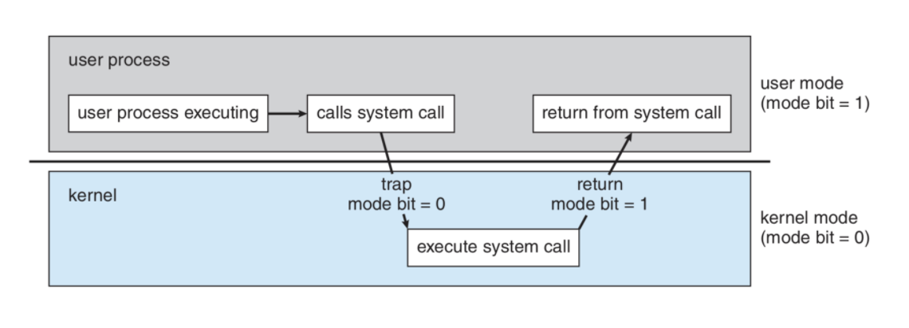
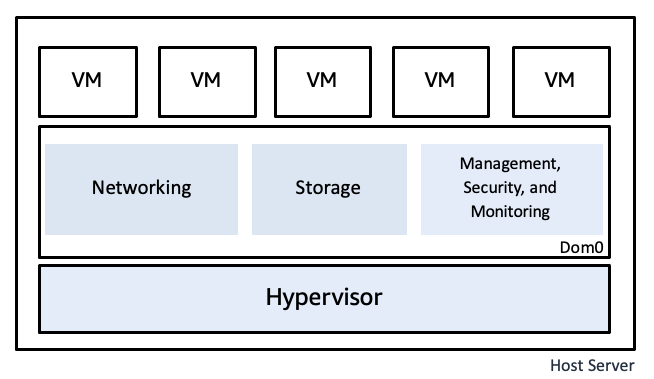

# 9장 - 운영체제 시작하기

OS에 대해 깊게 들어가기전에 큰그림을 그려보자.

## User mode vs Kernel mode
수 많은 응용 프로그램이 컴퓨터의 자원을 관리하는 커널 프로그램을 다루면 안된다. 그래서 접근할 수 있는 권한을 두가지 모드로 정의함.

- User mode
  - 일반적인 응용 프로그램 모드가 실행되는 모드
  - 커널 영역의 코드를 실행할 수 없는 모드임
- Kernel mode
  - 커널 영역의 코드를 실행할 수 있는 모드
  - kernel mode여야 컴퓨터 자원에 접근할 수 있음.

System call(Trap)를 통해 mode를 바꿔서 명령어를 실행한다. CPU의 mode bit로 이 명령어(요청)은 어떤 mode인지 판별할 수 있다.

---

> Q. VM(Guest OS)에서도 하드웨어의 선점이 필요한 작업들이 있다. Guest Kernel이 사용하는 CPU, RAM 등의 자원은 실제로 어디서 오는가?

> A. Guest OS에는 가상 하드웨어(vCPU, Virtual Memory, Virtual Disk 등)가 보이고, Hypervisor가 이를 실제 물리 하드웨어에 연결하고 여러 VM 사이에서 배분 및 격리함.

 

---

> Q. 운영체제의 커널은 이미 만들어져 있는데, 이후에 만들어지는 다양한 응용프로그램을 어떻게 실행할 수 있는가?
 
> A. 모든 프로그램이 컴퓨터 자원을 쓰는 명령어 자체가 한정적임. Read/Write, 메모리 선점, 프로세스 할당 등. 이를 추상화 시켜놨기 때문에 다양한 응용 프로그램들의 요청을 대응할 수 있다.