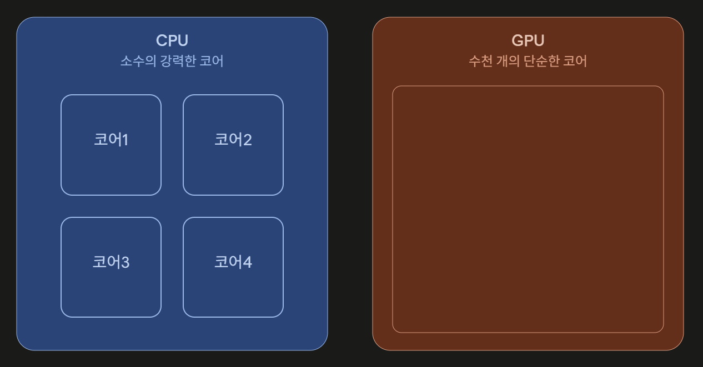

## Chapter 10-1 프로세스 개요

주요 키워드: 프로세스, 프로세스 제어 블록, 문맥 교환, 프로세스 사용자 영역

## Chapter 10-2 프로세스 상태와 계층 구조

주요 키워드: 프로세스 상태, 부모 프로세스, 자식 프로세스, 프로세스 계층 구조

### 궁금해요

> Q. 카카오톡 자동 실행을 체크 해놓으면, 자식 프로세스가 생성되는 것 처럼 Tree형태로 실행 되는 것인가?

맞다. 윈도우로 보면,

```java
최초의 프로세스 (System, PID 4)
↓
smss.exe → wininit.exe → services.exe ...
↓
winlogon.exe (로그인 담당)
↓
사용자 로그인 성공
↓
explorer.exe (바탕화면/작업표시줄) 생성
↓
explorer.exe가 "시작 프로그램" 목록을 확인
↓
카카오톡.exe 프로세스 생성! (explorer.exe의 자식으로)
```

이런 Tree구조로 실행되어지고 있던 것이다.

## Chapter 10-3 스레드

주요 키워드: 스레드, 멀티프로세스, 멀티스레드

### 추가 궁금해요

> Q. CPU 설명을 듣다보니 GPU가 궁금해졌다. GPU란 무엇일까? 그래픽카드?

그래픽카드(Graphics Card)는 하드웨어 통짜 제품(보드) 이름이고, 그 보드 위에 붙어있는 연산을 실제로 담당하는 칩이 GPU(Graphics Processing Unit)이다.

그래픽카드(보드) = GPU 칩 + VRAM(전용 메모리) + 냉각팬 + 회로 등

CPU가 마더 보드에 꽂히는 칩이라면 GPU는 그래픽카드라는 보드에 꽂혀 있는 칩이라고 생각하면 된다. (요즘엔 CPU 안에 내장 그래픽으로 GPU가 함께 들어있는 경우도 많다.)

CPU와 GPU의 큰 차이는 어떤 연산을 위해 존재하는가 이다.



CPU는 소수의 똑똑한 일꾼이라면 GPU는 다수의 단순한 일꾼이다.

### CPU: "복잡한 일 하나를 빠르게"

- 코어 개수: 보통 4~16개 (요즘 고급 CPU도 최대 수십 개 수준)
- 각 코어는 매우 복잡하고 똑똑함 — 분기 예측, 명령어 순서 재배열, 캐시 관리 등 온갖 최적화 기능이 다 들어있음
- **순차적이고 복잡한 로직**(if문, 반복문, 다양한 판단)을 빠르게 처리하는 데 특화됨
- 예: 엑셀 계산, 웹 브라우징, OS 관리, 게임의 "게임 로직" 부분

### GPU: "단순한 일 수천 개를 동시에"

- 코어 개수: 수백~수만 개 (예: RTX 4090은 CUDA 코어가 16,000개 이상)
- 각 코어는 아주 단순함 — 복잡한 판단은 못하지만, 똑같은 연산을 병렬로 엄청 많이 처리 가능
- **그래픽 렌더링**이 대표적인 이유: 화면의 픽셀 수백만 개는 각각 "이 픽셀 색깔이 뭐지?"라는 **똑같은 종류의 계산**을 반복해야 하는데, 이건 코어 하나가 순서대로 처리하는 것보다 코어 수천 개가 픽셀 하나씩 나눠서 동시에 처리하는 게 압도적으로 빠름

> Q. GPU 대표 사용 케이스는?

AI/딥러닝 학습이 결국 행렬 곱셈 같은 단순 연산을 수백만 번 반복하는 작업이라서, GPU의 "병렬 처리" 특성이 딱 들어맞는다. 그래서 요즘 GPU는 "그래픽카드"라는 이름이 무색하게 AI 학습용으로 훨씬 더 많이 쓰이고 있다. (엔비디아가 AI 붐으로 급성장한 이유)

> Q. 실시간 채팅 구현 할 때 소켓 통신이라는 말을 들었다. 소켓이란 무엇일까?

소켓이란 네트워크 통신을 위한 통로이다.

전화기의 수화기를 떠올려보자. 전화를 걸려면 수화기를 들어야 하듯, 네트워크로 데이터를 주고받으려면 소켓이라는 "통신용 인터페이스"를 열어야 한다.

> Q. 그렇다면, 실시간 채팅에서 소켓이 왜 필요할까?

일반적인 웹사이트 방문(HTTP 요청)은 질문 하나 던지고 답 하나 받고 끝. 하지만 채팅은 누가 언제 메시지를 보낼지 모르니까, 연결을 계속 열어둔 채로 "언제든 실시간으로 데이터를 주고받을 준비"가 되어 있어야 한다.

이렇게 한 번 연결을 맺으면 끊지 않고 계속 유지하면서, 서버와 클라이언트 양쪽이 원할 때 아무 때나 데이터를 주고받을 수 있게 하는 것이 소켓 통신의 핵심 특징. 채팅, 온라인 게임, 실시간 주식 시세처럼 "라이브"가 중요한 서비스에 딱 맞는 방식이다. 추가로 IP와 포트(Port)번호 또한 지정해야 한다.

> Q. 포트(Port)랑 IP랑 다른 건가?

IP 주소는 컴퓨터의 주소를 의미하는데, 컴퓨터 내에서 프로그램을 돌리지 않겠는가? 그럼 어느 프로그램으로 가야할까를 알려주는 것이 포트이다.

React를 켰을 때 주소 endpoint에 :8080이 뜨는 것이 포트이며 일반 웹사이트는 보통 포트 80(HTTP) 또는 443(HTTPS)을 기본으로 써서 생략되어 있을 뿐이다.
