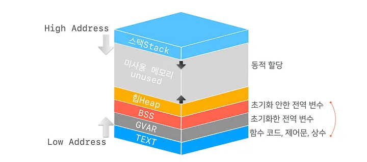
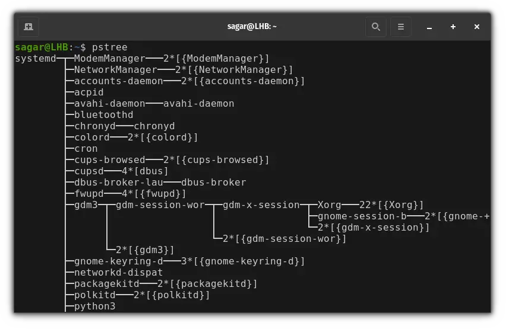
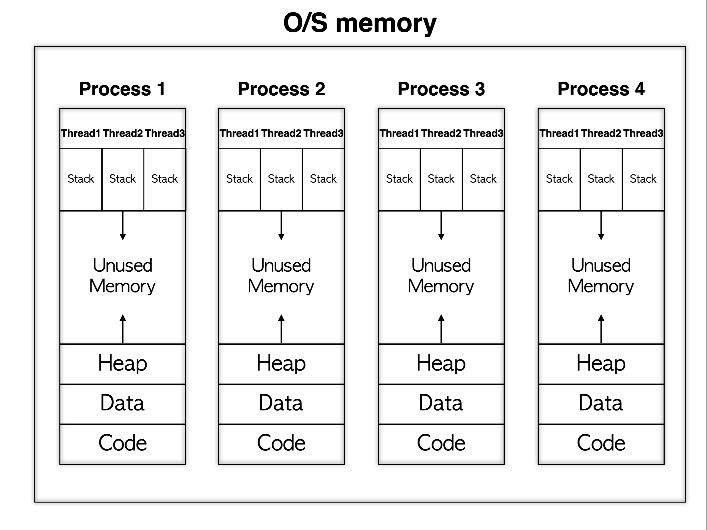
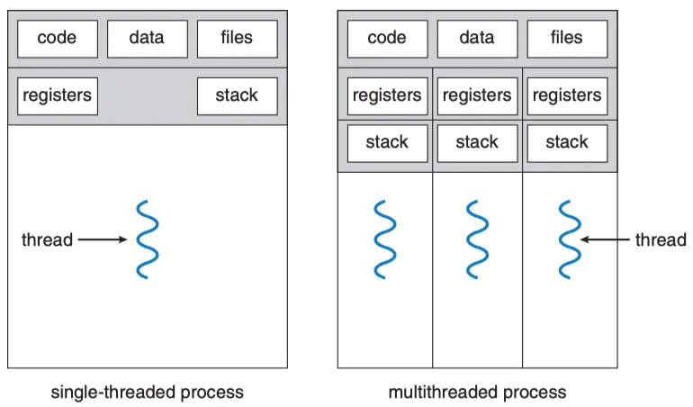
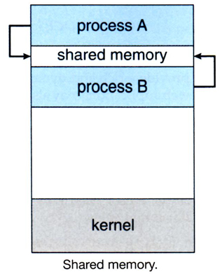

# 10장 - 프로세스와 스레드

운영체제의 실행 단위인 프로세스와 스레드에 대해 자세히.

## 프로세스 메모리 영역




- stack 넘침 -> stackOverFlow
- heap메모리 할당할 메모리 없음 -> OutOfMemory(OOM)

```java
// 팩토리 메서드
Member createMember(Long id){ -> stack
    // 팩토리에 필요한 메서드들~~    
    new Member(id); -> heap
}
```

> Q. 초기화한 전역 변수랑 안한거를 왜 분리해놓을까?(BSS vs GVAR)
 
> A. 실행 파일의 크기를 줄이기 위해서. static int a = 1234;처럼 초기값이 있는 경우 실제 값을 실행 파일에 저장해야 하지만, 0으로 초기화되는 변수는 값 자체를 저장하지 않고 필요한 공간의 크기만 기록해두면 됨.

---
### fork와 exec을 통해 트리 구조를 만들어간다.
- fork() : 자신의 복사본을 자식 프로세스로 생성해냄
- exec() : 자식 프로세스가 자신의 메모리 공간을 다른 프로그램으로 교체함.

둘다 system call임.


---
### 멀티스레드
스레드: 프로세스를 구성하는 실행 흐름 단위, 이 개념이 도입되면서 하나의 프로세스가 한번에 여러 일을 동시에 처리할 수 있게됨.

아래 사진처럼 Thread는 자신만의 Stack 영역을 가짐.


많은 운영체제에서는 CPU에 처리할 작업을 전달할 때 스레드 단위로 전달함.


> Q. 그럼 프로세스 많이 만들어서 효율 올리는 것보다(메모리 차지하지 말고), 스레드 만드는게 더 값싸고 효율적인 거 아닌가?

 
> A. 맞음. 스레드들이 같은 Code, Data, files 공유하기 때문에 생성, 전환, 데이터 공유 비용 측면에서는 스레드가 더 가벼움.
> 
> "격리"의 이유가 큼.Thread A가 잘못된 포인터로 Heap을 망가뜨리면 같은 Process의 Thread B, C까지 영향 받음.
> 
> 롤이 잘못되었다고 디스코드가 꺼지면 안되지 않겠는가?
> 
> Thread → 가볍고 공유가 쉬움 / 대신 서로 영향을 주기 쉬움
> 
> Process → 상대적으로 무겁고 통신 비용이 큼 / 대신 격리가 강함

 
--- 

### IPC와 Shared Memory
IPC: Inter-Process Communication, 프로세스 간 통신

프로세스끼리 메시지를 주고받는 방법에는 두가지가 있음
- Message Passing
  - 프로세스 A가 커널에게 데이터를 전달(Wriet/send)하고, 커널이 프로세스 B가 받을 수 있게 해주는(Read/recv) 방식
  - 큰 데이터를 반복해서 전달할 때는 복사/커널 비용이 큼. 
- Shared Memory
  - 같은 메모리를 보는 방식
  - 메모리 관리를 따로 해줘야한다는 단점이 있지만, 큰 데이터를 반복해서 전달할 때는 비용을 낮출 수 있음.
  - 대용량 데이터 처리, 멀티미디어/영상 처리, 고성능 서버, 데이터베이스 같은 시스템에서 활용



---

### 자바 21의 가상스레드
전통적인 Java Thread는 기본적으로 Stack memory를 쓰는 OS Thread임

따라서 요청마다 Thread를 생성하는 방식에서는 동시 요청이 많아질수록 많은 OS Thread가 필요하고, 각 Thread의 Stack 메모리와 OS 스케줄링 비용이 증가함. 또한 I/O를 기다리는 동안 OS Thread가 대기 상태가 되는 것도 시간 부담이 큼.

Java 21에서는 JVM이 관리하는 Virtual Thread가 정식으로 도입됨.

수많은 Virtual Thread를 비교적 적은 수의 OS Thread 위에서 실행할 수 있어, 특히 I/O 대기가 많은 서버에서 적은 비용으로 많은 동시 요청을 처리하기 유리함.


좋은 글 : https://mangkyu.tistory.com/309