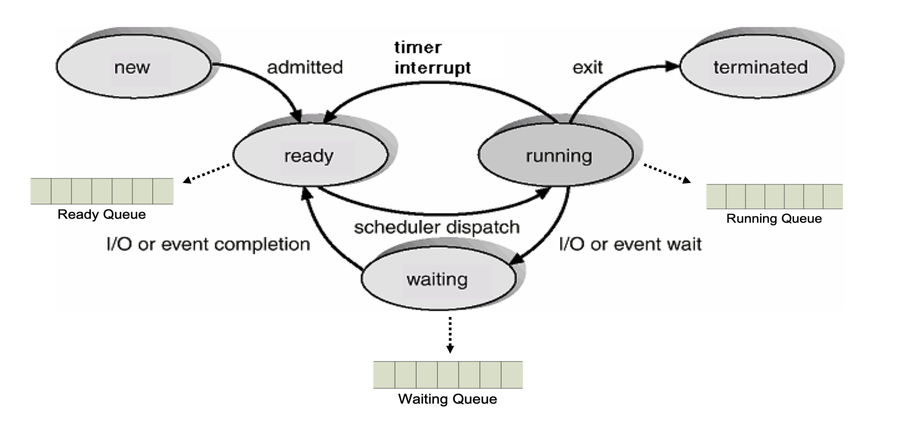
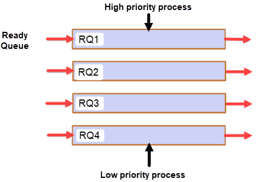

# 11장 - CPU 스케줄링

프로세스는 서로서로 리소스를 먼저 쓰고자 한다! 한정된 자원이기에, OS가 효율적으로 오케스트레이트 해줄 필요가 있음.

---

## CPU Burst vs I/O Burst

- CPU Burst
  - 프로세스가 CPU를 연속적으로 사용하는 구간
  - CPU Burst 이후 상황에 따라
    - I/O 요청 → Waiting
    - Time Quantum 만료 / CPU 선점 → Ready
    - 실행 완료 → Terminated
- I/O Burst
  - 디스크, 네트워크 등의 I/O 작업을 수행/대기하는 구간
  - Running 중 I/O를 요청하면 Waiting 상태로 이동
  - I/O 완료 시 인터럽트가 발생하고 Ready Queue로 이동
  - 이후 스케줄러가 CPU를 할당하면 다시 Running

=> I/O Bound Process는 CPU Burst가 짧은 경우가 많아서 CPU를 오래 붙잡지 않고 금방 I/O를 요청함.

=> I/O 프로세스를 적절히 먼저 처리하면 CPU와 I/O 장치를 동시에 바쁘게 사용할 수 있어서 전체 시스템 효율이나 응답성이 좋아질 수 있음.

> Q. terminated되는 경우는 어떤 경우인지? 

> A. 프로세스의 실행이 모두 끝나거나, 오류 또는 강제 종료 등으로 더 이상 실행되지 않을 때 Running → Terminated 상태로 이동한다.

---

### 현대 운영체제의 스케줄링은 하나의 고전 알고리즘을 그대로 사용하는 것이 아니라, 여러 아이디어를 조합하여 사용함. 
### 따라서 외우기보다는 각 알고리즘의 핵심 아이디어와 장단점을 이해하자.

---

- non-preemptive Scheduling
  - FCFS(First Come First Served)
    - 선입선출
    - Convoy Effect 발생 가능성 다수
  - Round Robin
    - 프로세스들 Time Slice만큼의 시간을 돌아가며 CPU를 사용함.
    - Time slice만큼 사용했는데 프로세스가 안끝나면 Context Switching 발생
- Preemptive Scheuling
  - SJF(Shortest Job First)
    - Ready Queue에 있는 프로세스들 중 CPU 이용 시간의 길이가 가장 짧은 프로세스부터 실행
  - SRT(Shortest Remaining)
    - SJF + Round Robin
    - Time Slice만큼 사용하되, 작업 시간이 가장 적은 프로세스가 선점함.
  - Priority
    - 프로세스별로 우선순위를 적용하고, 그 우선순위에 따라 CPU 선점
    - 계속 우선순위 높은 순위만 쓰느라, 낮은 순위들은 이용하지 못하는 Starvation(기아) 현상 발생
    - 오랫동안 대기한 프로세스의 우선순위를 점차 높이는 Aging 기법으로 방지.
  - Multilevel Feedback Queue
    - 우선순위가 다른 여러 개의 Ready Queue를 사용
    - CPU를 오래 사용하는 프로세스는 점점 낮은 우선순위 큐로 이동
    - 오래 기다린 프로세스는 높은 우선순위로 올려 Starvation을 방지할 수 있음
    - 

### Convoy Effect(호위 상태)

CPU를 오래 쓰는 프로세스 하나 때문에, 뒤에 있는 짧은 프로세스들이 줄줄이 기다리는 현상.

### Time slice(Quantum)
각 프로세스가 CPU를 사용할 수 있는 정해진 시간을 의미

이 크기를 특징에 맞게 적절히 정하는 것이 중요함.
너무 크면 Convoy Effect 발생하고, 너무 작으면 Context Switching 비용이 너무 커짐

> Q. 책에서는 CPU를 오래 사용해야 하는 프로세스는 점차 우선순위가 낮아진다고 표현함. 그만큼 CPU를 오래 점유하니까 비효율적인건 알겠는데, 그만큼 중요한 일일 수도 있는데 우선순위가 낮아진다고 말할 수 있는 걸까?

 
> A. 여기서 우선순위는 작업의 "중요도"가 아니라 CPU 스케줄링상의 우선순위를 의미함.
짧게 CPU를 필요로 하는 프로세스를 먼저 처리하면 빠르게 완료되거나 I/O 작업으로 넘어갈 수 있어 전체적인 응답성이 좋아지기 때문이다.
즉, 전체적인 스케줄링 설계관점에서 보자는 것이다. 설계 후 Starvation을 해결하는 기법으로 방지하는 쪽을 택함.
 

> Q. 그럼 결국 스케줄링의 "우선순위 기준" 무엇인가?(책에서는 CPU 선점시간으로만 따짐)

> A. 알고리즘마다 중요하게 보는 기준이 다름(Time Slice, CPU선점시간, 공정성, 대기시간 등..) 
> 
> 현대 OS 스케줄링은 여러 알고리즘을 복합적으로 사용하므로 각 아이디어와 장단점을 이해하자!