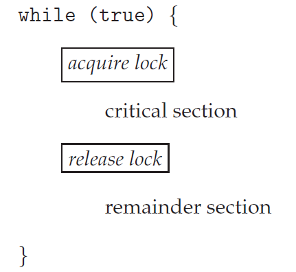
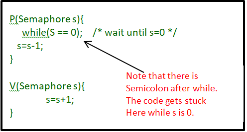
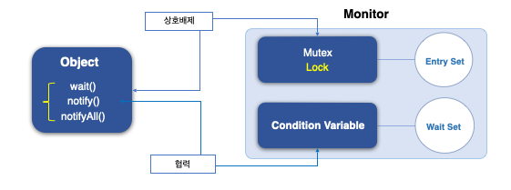

## 12장 - 프로세스 동기화

주요 키워드 : synchronization, Mutual Exclusion, Race Condition

- 실행 순서 제어를 위한 동기화
  -  특정 작업 간의 선후관계 보장
  -  A 다음에 B
- 상호 배제(Mutual Exclusion)를 위한 동기화
  -  공유 자원에 대한 동시 접근 방지
  -  "A와 B가 동시에 하면 안 됨"

실행순서를 제어해서 Mutual Exclusion을 만드는 것은 맞지만, 개념적으로 위와 같다고 이해하자.

---
### Critical Section
동시에 실행하면 문제가 발생하는 코드영역을 Critical Section(임계 구역) 이라고 부름.

### Race Condition
여러 프로세스가 동시 다발적으로 임계 구역의 코드를 실행하면 동시성 문제가 발생함. 이를 Race Condition이라고 부름.

---

Synchronization 기법으로 대표적으로 3가지를 정리

### 뮤텍스 락
- 하나의 공유 자원에 한 번에 하나의 프로세스/스레드만 접근하도록 막는 방식
- 자원에 들어가기 전 lock(acquire), 사용 후 unlock(release)
- 대표젹인 Mutual Exclusion 기법

얻고자 하는 프로세스는 lock을 잡을 수 있는지 없는지 쉴 새 없이 확인해봄. 이를 busy wait(바쁜 대기) 라고 개념적으로 부름

> Q. Busy wait은 CPU가 낭비가 심하지 않을까? 어떻게 처리?

> A. 짧게 기다릴 것 같으면 Busy Waiting, 오래 기다릴 것 같으면 Block/Sleep 방식

---

### 세마포어
- 공유 자원에 동시에 접근할 수 있는 개수를 정수 값으로 관리
  - wait(P)
    - 자원이 있으면 Semaphore 값을 감소시키고 사용
    - 자원이 없으면 대기
  - signal(V)
    - 사용이 끝나면 Semaphore 값을 증가시켜 다른 프로세스가 사용할 수 있게 함
    - 초기값이 1인 Binary Semaphore는 뮤텍스와 비슷하게 상호 배제에 사용할 수 있음

### 모니터 
- 공유 자원과 동기화 로직을 하나로 묶어서 관리하는 동기화 방식
  - 내부적으로 한 번에 하나의 스레드만 실행되도록 상호 배제를 보장
  - 필요하면 wait, signal 같은 조건 동기화도 함께 사용
- 상호배제 뿐만 아니라 조건 기반 실행 순서까지 제어 가능하므로 대부분의 언어에서 인터페이스로 제공중

> Q. 이런 OS 계층에서 락을 건드리는 경우가 많나?

> A. 일반적인 서비스 개발에서는 OS 수준의 Mutex나 Semaphore를 직접 다룰 일은 많지 않다. 보통 언어, 프레임워크가 대신 처리하며, 개발자는 synchronized, DB Lock, 트랜잭션, 분산 Lock 같은 더 높은 수준의 이해도로 이 기능을 적극 활용하면 된다. (재고 차감,
쿠폰 선착순 발급)

> Q. DB 트랜잭션과 뭐가 다른가?

 
> A. OS Lock은 같은 메모리나 자원에 동시에 접근하는 스레드/프로세스를 제어하는 것이고, DB 트랜잭션은 여러 SQL 작업을 하나의 작업 단위로 묶어 commit/rollback을 보장하는 것이다. 개념적으로는 비슷하지만 적용 방식이 다름.
다만 트랜잭션도 동시성 충돌을 막기 위해 내부적으로 Row Lock 같은 DB Lock을 사용할 수 있다.