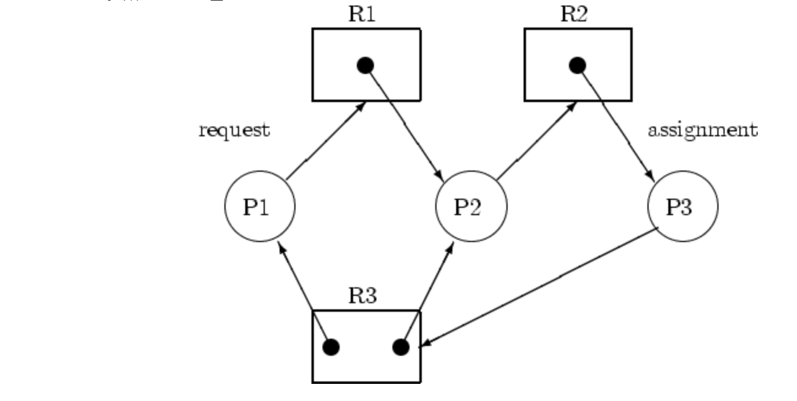
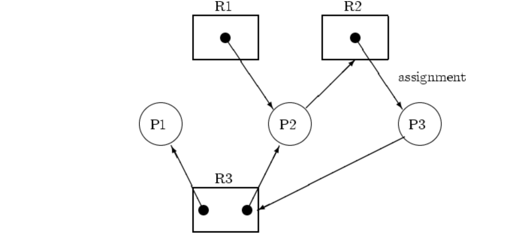
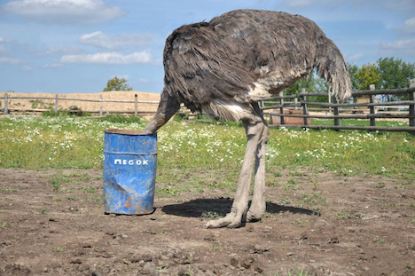

## Chapter13-1 교착 상태란

주요 키워드: 교착 상태, 식사하는 철학자 문제, 자원 할당 그래프, 교착 상태 발생 조건

### 궁금해요

> Q. 원형이란 무엇일까? 원형 대기의 다른 예시를 살펴보자.

P1 → R1 → P2 → R2 → P3 → R3 → P1

“따라서 이 자원 할당 그래프는 사이클의 형태이다.” 라고 설명하면 충분할까? 말로 풀어보면

P1 프로세스는 R1 자원을 “요청”한다. →

R1 자원은 P2 프로세스를 “점유”한다. →

P2 프로세스는 R2 자원을 “요청”한다. → …

아 그러면 관계를 표시해 봤을 때, 요청 equals 점유로 퉁치고 사이클의 형태가 이루어지면 이건 원형 대기 상태구나! ⇒ 그렇지 않다.

“요청”과 “점유(독점)”이라는 방향성을 무시하고 글자 그대로 읽는 것은 매우 위험하다.

원형 대기는 단순히 글자가 이어지는 형태가 아닌, 화살표의 방향이 꼬리에 꼬리를 물고 하나의 원을 이룰 때를 의미한다.

이를 적용한 흐름으로 다시 읽어보면

1. **P1**은 **R1**을 가지고 싶어 기다린다 (P1 -> R1)
2. 그런데 **R1**은 이미 **P2**가 가지고 있다 (R1 -> P2)
3. **P2**는 **R2**를 가지고 싶어 기다린다 (P2 -> R2)
4. 그런데 **R2**는 이미 **P3**이 가지고 있다 (R2 -> P3)
5. **P3**은 **R3**을 가지고 싶어 기다린다 (P3 -> R3)
6. 그런데 **R3**은 다시 **P1**이 가지고 있다 (R3 -> P1)

라는 것. 원형 대기의 확인은

`“원하는대 이미 점유되어 있고, 그 점유한 녀석(자원/프로세스)가 다른 걸 원하고..”`

의 반복이 되는 인과관계를 따졌을 때 비로소 정확하게 확인이 가능하다.

> Q. 원형이지만 교착 상태가 아닌 예는 어떤 게 있을까?

프로세스 p1이 작업을 완료하고 R3의 자원을 반환하면 p3은 p1이 반환한 자원을 할당 받으면 된다.

## Chapter 13-2 교착 상태 해결 방법

주요 키워드: 교착 상태 예방, 교착 상태 회피, 교착 상태 검출 후 회복

### 궁금해요

> Q. 원형 대기 조건을 없애기 위해선, 각각의 자원마다 번호를 부여해 주어야 한다. 하지만, 책에서는 자원마다 번호를 부여하는 건 그리 간단한 작업이 아니라고 말한다. OS는 더 복잡한 CPU 스케줄링도 잘하는데, 단순히 번호를 부여하는 이 작업은 왜 간단한 작업이 아니라고 말하는 것일까?

CPU 스케줄링은 "런타임에 반복되는 알고리즘 문제”이다. (동적 flow)

CPU 스케줄링은 OS가 정의한 명확한 기준(우선순위, 남은 실행시간, 대기시간 등)을 바탕으로, 매 순간 "누구를 다음에 실행할까"를 계산하는 문제이다. 입력값(프로세스들의 상태)이 바뀌면 그에 맞춰 알고리즘이 자동으로 다시 계산해줍니다. 즉, OS 내부에서 자체적으로 풀 수 있는 최적화 문제이다.

반면 자원 순서 부여는 “애초에 규칙 자체를 무엇으로 정할지”가 어려운 문제이다.

> Q. 교착 상태 해결 방법에 대해 크게 3가지(예방, 회피, 검출 후 회복)을 배웠다. 가장 좋은 해결 방법은 무엇일까?

당연하게도 세 가지 중에서 가장 좋은 방법은 없다. 상황에 따라 상이하다.

> Q. 그렇다면, 가장 범용적으로. 실무적으로 사용하는 방법은 무엇일까?

예방 → 안정성 최고, 성능 최저

회피 → 최대 자원 요구량을 알아내는 것은 비현실적이며 오버헤드

검출 후 회복 → 성능은 좋지만 복구 비용에서 오버헤드

실제 범용 OS(Linux, Windows, UNIX)에서 가장 흔하게 사용하는 방법은 아무것도 안 하기 이다.

교착 상태는 실제로 자주 발생하지 않는다. 단순하게 시스템을 재부팅 하거나, 관리자가 프로세스를 수동으로 종료하여 해결한다.
