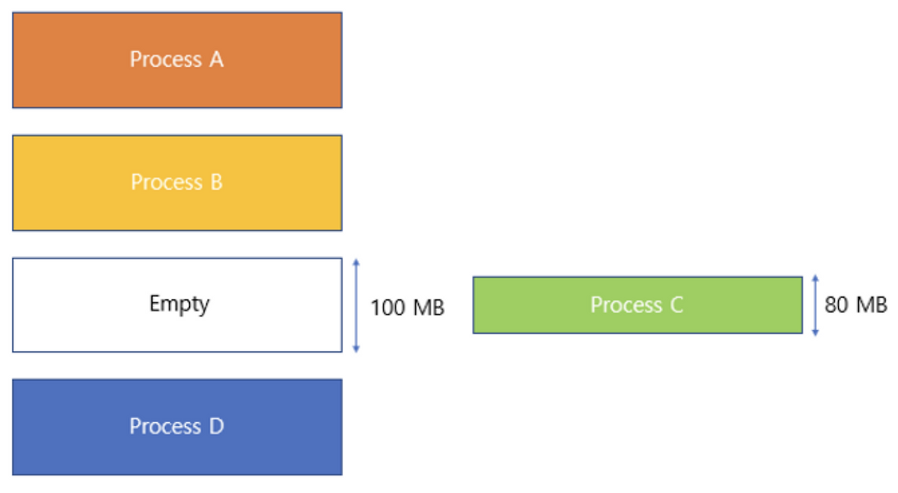
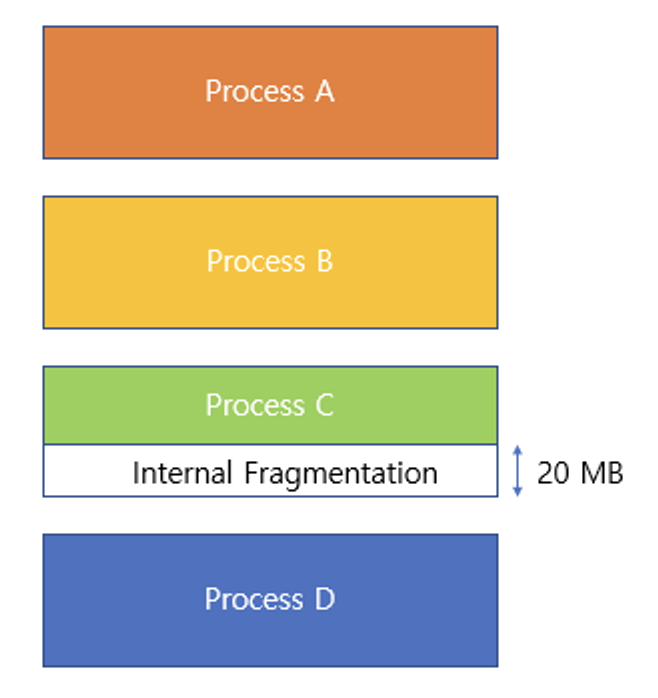

## Chapter 14-1 연속 메모리 할당

주요 키워드: 스와핑, 최초 적합, 최적 적합, 최악 적합, 외부 단편화

### 궁금해요

> Q. 책의 392p 스왑 영역 확인하기 부분에서 “스왑 영역의 크기와 사용 여부는 사용자가 임의로 설정할 수 있다”라고 나와있는데, 사용자가 원할 때 스와핑을 할 수 있다는 뜻인걸까?

사용자가 설정하는 건 스왑 공간을 얼마나 만들어둘지, 아예 쓸지 말지" 라는 사전 설정을 의미하며 스와핑의 실행 여부는 OS가 결정한다.

**실제 스와핑이 일어나는 과정: 사용자 개입 없음**

1. 커널이 상시 감시: OS 커널은 메모리 사용량을 계속 추적하고 있다. 별도로 사용자가 "확인해봐"라고 요청할 필요가 없다.
2. 임계치 도달 시 자동 판단: 사용 가능한 메모리(free memory)가 특정 수준 이하로 떨어지면, 커널이 자체 알고리즘(예: LRU 기반으로 "가장 오랫동안 안 쓰인 페이지")으로 스왑 아웃할 대상을 알아서 고른다.
3. 커널모드는 이미 그 안에서 일어나는 일: 애초에 메모리 관리는 커널의 고유 업무 영역이라 항상 커널 모드에서 수행된다. 사용자 프로세스가 뭘 요청해서 "커널 모드로 전환"되는 게 아니라, 커널이 백그라운드에서 원래부터 하고 있는 일이다.

> Q. 외부 단편화? 이게 무슨 말일까. 그리고 내부 단편화도 있는 걸까?

External Fragmentation: 외부 단편화. 할당된 영역 바깥(external)에 파편,조각(fragmentaion)이 생겼다는 것을 의미한다. 원어의 비유가 잘 와닿지 않을 땐 원어로 외워보자.

Internal Fragmentation: 내부 단편화. 프로세스가 실제로 필요한 양보다 더 큰 메모리를 할당받아, 블록 내부에 사용되지 않는 공간이 생기는 현상이다. 그림으로 보면,

이렇게 살펴볼 수 있다.

> Q. 외부 단편화의 해결방법은 압축(compaction)이었다. 그렇다면 내부 단편화의 해결방법은 무엇일까?

세그멘테이션(Segmentation) 기법이 있다. 프로세스를 크기가 고정된 단위가 아니라, 코드·데이터·스택 등 논리적인 의미 단위(세그먼트)로 자르는 방식이다. 위 그림으로 설명하면

Process C를 빈 공간에 적재하기 전에 Empty의 공간을 80 MB만큼(필요한 만큼)잘라서 사용하는 것이다.

어? 그러면 외부 단편화가 또 생기는 것 아닌가? → 맞다. 다음 Chapter에서 페이징을 배워보자.

## Chapter 14-2 페이징을 통한 가상 메모리 관리

주요 키워드: 페이징, 페이지 테이블, PTBR, TLB

### 궁금해요

> Q. 페이지는 크기는 얼마일까?

보통 4KB의 크기로 진행한다. 비트 연산의 이점을 얻기 위한 크기(2의 제곱수)이기도 하며, 상황에 따라 허그 페이지(Huge Page)도 사용한다. 하지만 페이지는 크게 만들면 오버헤드가 발생할 수 있다.

| 페이지 크기     | 내부 단편화(최악의 경우)    | 페이지 테이블 크기                  |
| --------------- | --------------------------- | ----------------------------------- |
| 작게 (4KB)      | 최대 4KB 미만 낭비          | 테이블 항목 많아짐 (관리 오버헤드↑) |
| 크게 (2MB, 1GB) | 최대 2MB, 1GB까지 낭비 가능 | 테이블 항목 적어짐 (관리 오버헤드↓) |

따라서 일반적인 상황에서는 작은 페이지(4KB)가 유리하고 아주 큰 메모리를 통째로 오래 쓴다면 큰 페이지가 유리하다.

## Chapter 14-3 페이지 교체와 프레임 할당

주요 키워드: 요구 페이징, 페이지 교체 알고리즘, 스레싱, 프레임 할당
