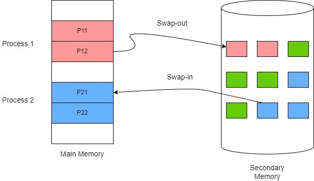
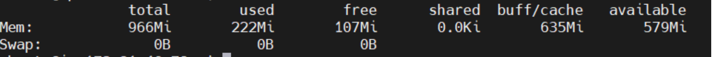
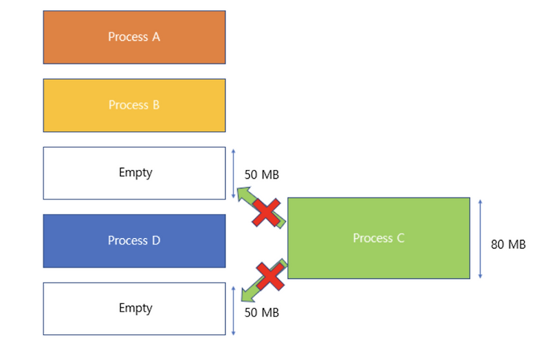
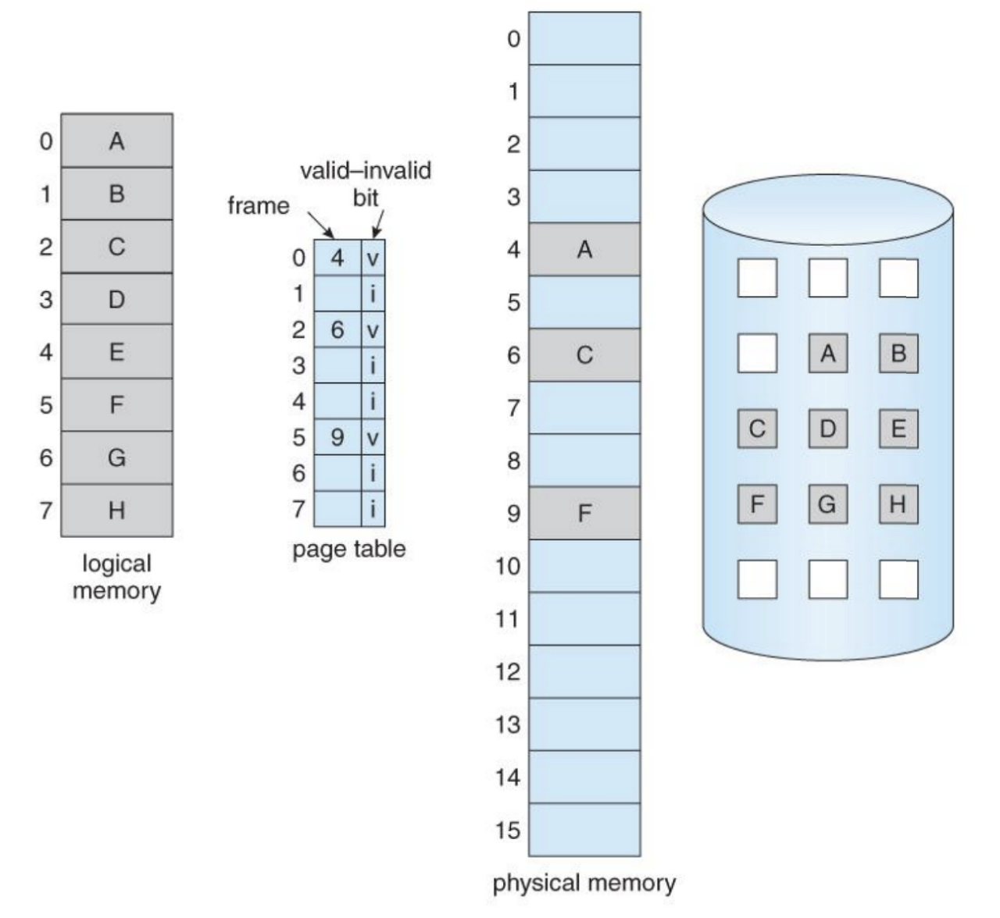
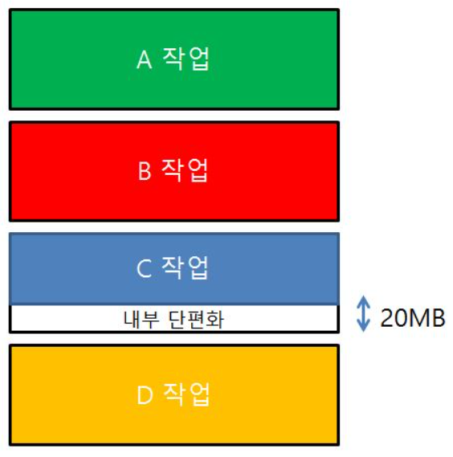
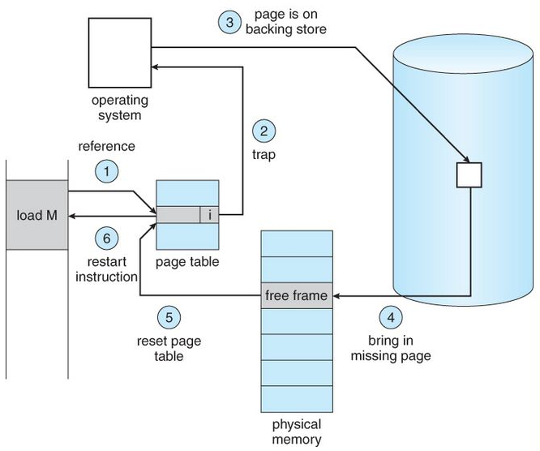
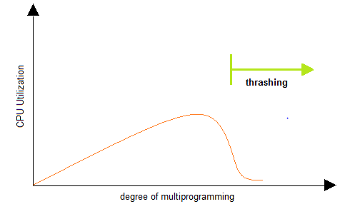

## 14장 - 가상 메모리

프로세스에게 독립적이고 큰 메모리가 있는 것처럼 추상화하고, OS가 실제 RAM을 효율적으로 나눠 쓰는 개념.

을 조금 더 이해하기 위해 스와핑 개념에 대해 알아보자.

### 스와핑(Swap)과 Swap Memory
당장 사용하지 않는 프로세스를 디스크로 옮기는 개념.

Swap Memory: Swap Out된 데이터를 임시로 저장하기 위해 SSD/HDD에 마련한 공간. 개발자가 따로 설정할 수 있음.


> Q. Swap Memory를 설정하면 RAM 용량이 늘어난다고 볼 수 있는가?

> A. 사용할 수 있는 메모리의 여유는 늘어나지만, 실제 RAM이 늘어나는 것은 아니다. Swap을 자주 사용하면 디스크 I/O 때문에 성능이 크게 떨어질 수 있다.


아래 사진은 EC2 프리티어는 RAM이 매우 작고, 기본적으로 Swap Memory가 없음. OOM이 나서 갑자기 서버 죽어버리는 경우 다수
 
보통 저장소는 따로 DB로 뺴기 때문에 스왑메모리 설정으로 이득본다. 

t3.micro
→ RAM 1GB

t3.small
→ RAM 2GB

---
### External fragmentation(외부 단편화)

Swap in, Swap out 하다보면 아래 사진 처럼, 전체 남은 램의 용량은 충분히 수용가능한데, 수용하지 못하는 메모리 낭비 상황이 발생할 수 있음.

이를 External fragmentation이라고 함.


---
### Paging

이를 해결하기 위해 프로세스의 논리 주소 공간을 Page 단위로 자르고, 물리 메모리(RAM)를 Frame 단위로 나눈다. 그리고 각 Page를 비어 있는 Frame에 분산 배치함.

아래 사진은 필요한 부분의 페이지 영역만 물리적 메모리에 할당하는 방법 Demand Paging을 나타낸 사진이다.


프로세스가 실행되면 MMU는 실시간으로 페이지테이블을 확인하고, 필요한 메모리가 물리적 메모리에 적재되어 있는지를 확인함. 이때 페이지 테이블의 valid-invalid bit가 v인지 i인지의 차이가 물리 메모리에 해당 페이지가 저장되어 있는지를 알려주는 것.

스와핑 : 메모리 내용을 RAM과 디스크 사이에서 이동시키는 큰 개념

Demand Paging = 필요한 Page만 실제 접근 시점에 RAM에 올리는 가상 메모리 기법


---

### Copy on Write
프로세스를 복제할 때 처음부터 메모리를 전부 복사하지 않고, 같은 Page를 공유하다가 실제로 수정할 때만 복사하는 방식.
```text
부모 Process ─┐
              ├─ 같은 Page 공유
자식 Process ─┘

자식이 Page 수정
      ↓
해당 Page만 복사
```
- 불필요한 메모리 복사 감소
- fork() 같은 프로세스 생성이 빨라짐
- 메모리 사용량 절약

---

### Internal fragmentation(내부 단편화)
고정 크기 메모리 블록을 할당했는데, 실제 사용량이 그보다 작아서 할당된 블록 내부에 남는 공간이 생기는 현상.


페이징을 도입하면서 발생하는 불가피한 단점이므로, 내부 단편화와 관리 비용을 고려해 적절한 페이지 크기를 선택하는 것이 중요.


---

### TLB Miss vs Page Fault

Page Table은 RAM에 있음.

TLB가 없다면 가상 주소를 변환하기 위해 Page Table을 먼저 조회하고,
그 결과로 얻은 Frame 주소에 다시 접근해야 하므로 추가적인 메모리 접근이 발생함.

그래서 MMU에는 Page → Frame 변환 정보를 캐싱하는 TLB가 있음.

TLB Miss 랑 Page Falut랑 헷갈려서 정리함.

- TLB Miss = 주소 변환 정보를 못 찾음
- Page Fault = 실제 Page가 RAM에 없음

플로우는 다음과 같이 정리할 수 있겠다.

TLB Miss → Page Table 조회 → 해당 Page가 RAM에 없음 → Page Fault


1. 먼저 물리 메모리에 있는 실행될 프로세스는 자신이 사용하고자 하는 페이지가 페이지 테이블에 있는지 확인


2. 만약 물리 메모리에서 사용하려는 페이지가 없으면 Page fault exception을 발생시키고 커널 모드로 진입


3. OS는 페이지 테이블 엔트리 정보 속에서 Backing storage 어느 위치에 페이지가 있는지 확인

   
4. 확인한 없었던 페이지를 물리 메모리에 로드.


5. 페이지 테이블을 업데이트.

   
6. 이제 원래 실행하려고 했던 작업을 실행.

하지만 이때, 페이지 테이블을 읽고 Page fault로 인해 커널 모드로 진입하는 과정까지는 괜찮지만, Disk에서 페이지를 찾아서 가져오는 과정은 시간이 꽤 걸림. 결과적으로 CPU의 효율성을 낮추게 되죠.


### 이럴수록 페이지 교체 정책, 페이지 교체 알고리즘이 중요해진다!!(FIFO, Optimal, LRU 등등)

---

### 쓰레싱
프로세스가 실제 실행되는 시간보다 페이징에 더 많은 시간을 소요하여 성능이 저해되는 문제.

아래 사진은 프로세스는 많이 실행시킬수록 좋은 거 아닌가? 라는 의문을 해결해준다. 어느정도 선에서는 CPU 활용도가 올라가지만, 필요 이상으로 늘리면 각 프로세스들이 사용할 수 있는 프레임 수가 적어지기 때문에 page falut가 자주 발생하여 성능 저하.


