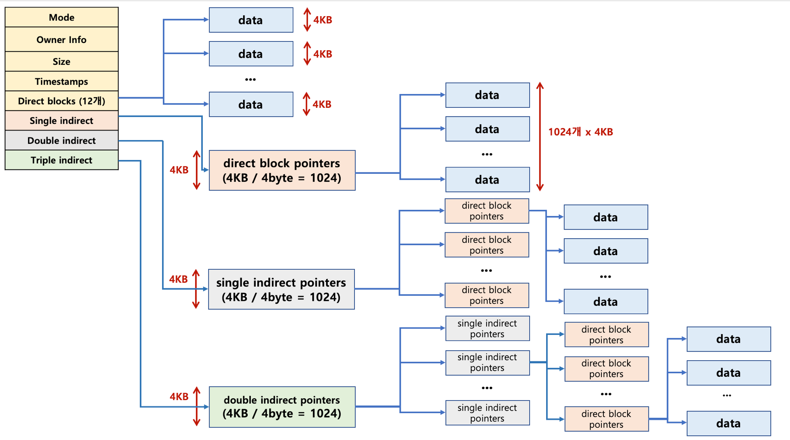

# 15장 - 파일 시스템

OS가 파일의 저장방식과 활용방식을 정함. 그 방식에 대하여.

### Partition & Formatting

Partition : 하드 디스크나 SSD처럼 용량이 큰 저장 장치를 하나 이상의 논리적인 단위로 구분

Formatting : 파일 시스템을 설정하여 어떤 방식으로 파일을 저장할 것인지 결정. 이때 어떤 종류의 파일 시스템을 쓸 것인지 결정

> Q. 도커의 파티셔닝과 비슷한 것인지?

> A. 개념적으로는 비슷함. OS의 파티셔닝은 실제 하드디스크를 논리적으로 나누는 것이고, Docker의 파일 시스템 계층(overlay filesystem), volume, namespace 등을 이용해 논리적으로 격리하는 것임.

---

### 파일 할당 방식(FAT, Unix)

- 연속 할당 (Contiguous Allocation)
  - 파일을 구성하는 Block들을 연속된 공간에 저장
  - File A → [10][11][12][13]
  - 외부 단편화 발생, 파일 크기 증가가 어려움
- 연결 할당 (Linked Allocation)
  - 각 Block이 다음 Block의 위치를 가리키는 포인터를 가지는 방식.
  - 10 → 27 → 35 → 41 → EOF
  - 포인터 때문에 블록 공간을 조금 먹고, 특정 블록을 찾으려면 앞에서부터 따라가야 한다는 단점
  - 연결 정보를 블록 내부가 아니라 별도의 테이블에 모아두는 방식으로 활용 -> "FAT" 파일 시스템
- 색인 할당 (Indexed Allocation)
  - 파일마다 Index Block을 두고, 그 안에 파일이 사용하는 Block들의 주소를 저장하는 방식
  - Index Block을 위한 추가 공간 필요

#### Unix 파일시스템
매번 Index Block을 하나씩 추가하는 게 아니라, inode 안의 고정된 포인터 구조를 이용해 작은 파일은 직접 접근하고(direct), 큰 파일일수록 Single → Double → Triple Indirect 방식으로 주소를 한 단계씩 더 거쳐 확장

--- 

### 저널링(Journal) 파일 시스템

Linux의 ext3, ext4, XFS 등이 대표적인 저널링 파일 시스템.

파일 시스템의 변경 내용을 실제 반영하기 전에 Journal 영역에 먼저 기록하고, 이후 실제 파일 시스템을 수정함.

이러한 방식을 통해 작업 도중 오류나 전원 차단이 발생해도 Journal을 바탕으로 복구하여 파일 시스템의 일관성을 유지할 수 있음.(Like 트랜잭션)

> Q. 그럼 게속 쓸 때마다 로그가 쌓인다는건데 어떻게 정리하는지?

> A. Journal은 고정된 크기의 순환 구조(Circular Log)로 관리한다. 실제 파일 시스템에 반영이 끝난 로그는 더 이상 필요하지 않으므로 재사용 가능한 영역으로 처리하고, 이후 새로운 로그가 그 공간을 덮어씀.