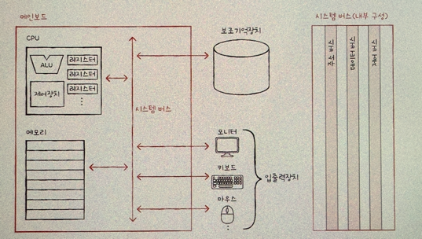

# 1장 - 컴퓨터 구조 시작하기
- 컴퓨터 구조를 알아야 하는 이유와 앞으로 이 책에서 다룰 컴구 내용의 로드맵 소개

### 데이터 & 명령어
컴퓨터는 0과 1 표현된 정보만 이해하는데, 그것도 크게 두가지로 나뉨.
- 데이터
  - 컴퓨터가 이해하는 숫자, 문자, 동영상 같은 정적 정보
- 명령어
  - 데이터를 움직이고 컴퓨터를 작동시키는 정보

### 컴퓨터의 네 가지 핵심 부품
- CPU
  - ALU(연산), 레지스터(CPU의 작은 저장장치), 제어장치(전기신호 보내고 명령어 해석) 로 구성
- 메모리(주기억장치)
  - RAM,ROM
- 보조기억장치
  - HDD, SDD
- 입출력장치
  - 모니터, 키보드, 마우스
---

## ROM에 대해 깊게 정리
- 기존 RAM에서는
  - Chrome 실행
  - VSCode 실행
  - 게임 실행
- 컴퓨터 끄면 꺼짐 -> 휘발성


- ROM(Read Only Memory)는 익숙치 않아 추가 정리함.
---

### ROM이란?

ROM(Read Only Memory)은 **컴퓨터가 부팅되기 위해 필요한 최소한의 프로그램을 저장하는 메모리**임.

대표적으로 아래와 같은 "부팅을 담당하는 펌웨어"들이 저장되어 있음.

- BIOS
- UEFI
- Firmware

RAM과 달리 **전원을 꺼도 내용이 사라지지 않는 비휘발성 메모리**임.

---

### 그럼 부팅 펌웨어를 SSD에 넣으면 안 되나?

컴퓨터를 켰을 때 CPU는 아직 SSD를 읽을 줄 모름(CPU는 그냥 연산 빠른 바보..)

SSD를 읽으려면
- SATA
- NVMe
- PCIe

같이 하드웨어 통신 관련 내용을 초기화하는 코드가 먼저 실행되어야 함. -> 그 코드가 바로 BIOS이다.

그래서 BIOS는 SSD가 아니라 ROM에 저장된다.(ROM은 메인보드 제조사가 BIOS를 미리 기록해서 출고한다고함.)

실제 부팅 과정을 정리해보면 아래와 같겠다.
```text
전원 ON
    │
    ▼
CPU
    │
    ▼
ROM(BIOS 실행)
    │
    ▼
RAM 초기화
    │
    ▼
SSD 초기화
    │
    ▼
운영체제를 RAM으로 복사
    │
    ▼
CPU가 운영체제 실행
```
---
다음 사진처럼 메인보드 위에서 시스템 버스(System Bus)를 통해 내용을 주고 받음.


-----
# 느낀점
AI도 결국은 이런 컴퓨터 구조 위에 실행되는 운영체제에서 활용되는 존재이기에, AI가 발전될수록 이런 지식들을 넓게 익히며 보다 더 넓은 시야에서 생각하는 것이 중요하다는 직감이 든다.

그래서인지, 앞으로 배울 내용들이 기대가 된다.

확실히 전공시험을 위해 외우는거랑, 이렇게 여유롭게 정리하면서 하는 거랑 머릿속에 다르게 남는 듯 하다.
아자자~~!

