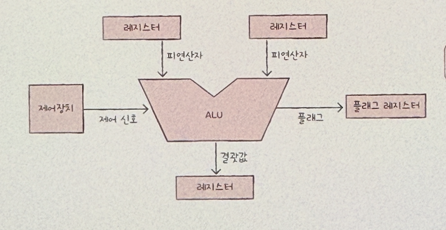
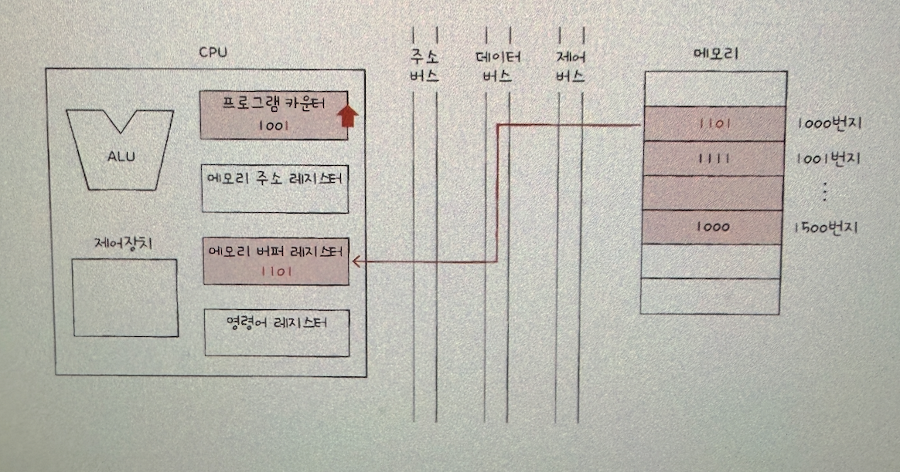

# 4장 - CPU의 작동 원리

ALU, 제어장치, 레지스터, 명령어 사이클, 인터럽트, 예외, 하드웨어 인터럽트, 인터럽트 서비스 루틴

### ALU
- 레지스터를 통해 피연산자를 받아들이고, 제어장치로부터 어떤 연산을 수행하는지 제어 신호를 받아들임
- 그 값을 바로 메모리로 가는 것이 아니라 레지스터에 저장해놓음
  - 메모리로 가는 것은 비교적 훨씬 느리기에 CPU 속도를 위해 이 방법을 채택
- 플래그 레지스터에 음수인지, 값이 너무 큰지 등 여러가지 플래그 값들을 보냄
  - 부호 플래그, 오버플로우 플래그, 인터럽트 플래그 등등 있음
  - 이런 여러 플래그를 통해 ALU는 계산에만 집중할 수 있음


### 제어장치는 어떤 연산을 해야하는지 어떻게 아는걸까?
명령어 레지스터가 메모리에서 명령어를 가져온 다음 제어장치가 이를 읽고 식별함.
```text
메모리(ADD R1, R2, R3)
│
▼
명령어 레지스터(Instruction Register가 ADD R1, R2, R3를 가져옴)
│
▼
제어장치(각 레지스터의 주소에서 값을 불러와서 ALU에게 계산 시킴, 플래그 레지스터도 참고하여)
│
├───────────┐ (제어 신호 : R1값 불러와, R2값 불러와 ADD 해라)
▼           ▼
레지스터(R1, R2, R3)      ALU(R1, R2, R3 ADD함)
```
- 제어 신호는 CPU뿐만 아니라 입출력장치를 비롯한 CPU 외부 장치도 발생시킬 수 있음.
  - 시스템 버스 중 제어버스를 통해 외부로 전달된 제어 신호를 받아들임.

-> 제어 장치가 보내는 **제어신호**는 내부(메모리, 레지스터) 외부(입출력장치의 값을 읽거나 쓰기 위한 매우 중요한 신호임.

---
### 레지스터
상용화된 CPU마다 레지스터들은 다 다름. 그럼에도 공통적으로 쓰이는 중요한 8가지 정리.

- 프로그램 카운터
  - 가져올 명령어의 주소를 저장. 명령어 포인터라고 부름
- 명령어 레지스터
  - 해석할 명령어. 메모리에서 읽어 들인 명령어 저장.
- 메모리 주소 레지스터
  - 메모리의 주소를 저장
- 메모리 버퍼 레지스터
  - 메모리와 주고받을 갑을 저장하는 레지스터

그림을 보면 메모리에서 값을 가져온다음 프로그램 카운터가 하나 증가함.
이런식으로 CPU 속 프로그램 카운터가 꾸준히 증가하기에 계속 실행해 나갈 수 있음.



- 범용 레지스터
  - 다양하고 일반적인 상황에서 자유롭게 사용
  - 현대 CPU는 범용 레지스터가 많음
- 플래그 레지스터
  - 연산 결과 또는 CPU 상태에 대한 부가적인 정보 저장

레지스터들은 대부분 스택 자료구조에서 주소들을 직접 지정하거나 +50 하거나 -50을 하는식으로 원하는 값이나 명령어를 찾아냄.


---
### 명령어 사이클
- 메모리에서 명령어를 가져오고, 이를 실행하고 저장하는 방식의 일정한 사이클에 따라 명령어를 처리해 나감.
