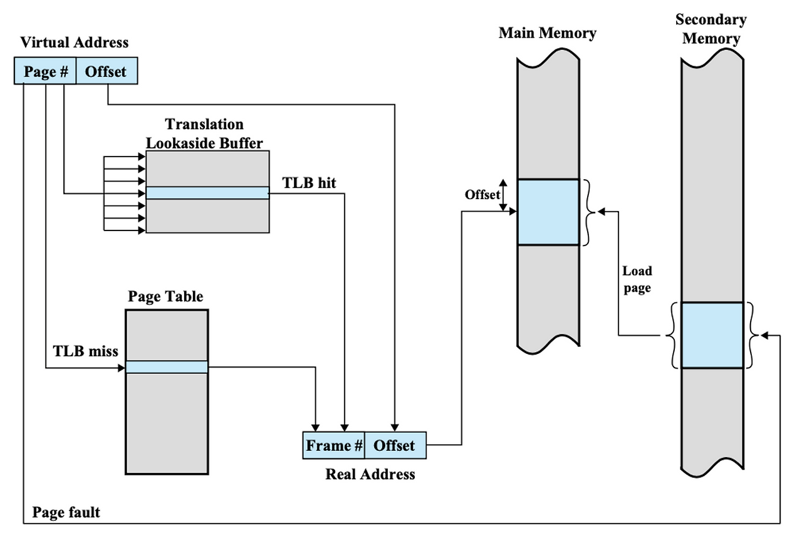

# 6장 - 메모리와 캐시 메모리

RAM에 대하여. 
결론적으로 CPU와 RAM은 거리가 멀다. 목적 없이 다녀오면 손해임. 이를 어떻게 설계했을까?

## RAM 종류

- DRAM(Dynamic Ram)
  - 시간이 지나면 저장된 데이터가 사라짐.
  - 비교적 소비전력 낮고, 저렴하고, 집적도가 높음
  - 삼성전자, 하이닉스 주력
- SRAM(Static Ram)
  - 시간이 지나도 데이터 사라지지 않음(물론 전원 끄면 사라짐)
  - DRAM보단 집적도 낮고, 소비전력도 크며, 가격도 더 비쌈
  - 그럼 왜 쓰나? -> 대용량으로 만들어질 필요는 없지만 빨라야하는 저장 장치 -> Cache Memory
- SDRAM(Synchronous Dynamic Ram)
  - 클럭 신호와 동기화된 DRAM.
  - 기존 비동기 DRAM보다 효율적(클럭 단위)로 CPU와 데이터를 주고받을 수 있음
  - 현재는 대부분 DDR SDRAM으로 대체되어 단독으로는 거의 사용되지 않음
- DDR SDRAM(Dobule Data Rate SDRAM)
  - 대역폭을 넓혀 속도를 빠르게 만든 SDRAM
  - 전송속도가 빨라서 최근 많이 사용됨


## MMU(Memory Management Unit)

메모리 관리 장치 - CPU가 작업하는 논리주소를 RAM의 물리주소로 바꿔줌.

## MMU가 정확히 어떻게 바꿔주는가?



Page : 가상 메모리(프로세스 입장)의 일정한 크기 블록
Frame : RAM을 같은 크기로 나눈 블록
Page Table : Page가 어느 Frame에 있는지 기록 


```text
① CPU가 Virtual Address 생성
│
② TLB 조회
│
├─ Hit  → Real Address 생성 → RAM 접근
│
└─ Miss
│
③ Page Table 조회
│
├─ 있으면 → Real Address 생성 → RAM 접근
│
└─ 없으면(Page Fault)
│
④ OS가 SSD에서 해당 페이지를 RAM으로 로드
│
⑤ Page Table / TLB 갱신
│
⑥ 다시 주소 변환 후 RAM 접근
```
---
## L1, L2, L3 Cache와 split Cache

캐시메모리는 SRAM으로 쓰임

코어와 가장 가까운 L1 캐시는 조금이라도 접급속도를 빠르게 만들기 위해
명령어만을 저장하는 L1 l 캐시와 데이터만을 저장하는 L1 D 캐시가 있다. -> Split Cache
.png)


## Cahce Hit, Miss를 감지하는 구체적인 방법은 어떻게 될까?

다 배열 방식으로 되어있음. 처음에는 O(1) 방식으로 접근하다가 LRU, FIFO 등 다양한 알고리즘을 찾음(후에 OS 시간에 깊게 다룸.)


